## 目录
- 第1章 [概述](https://github.com/Operations-Research-Science/Ebook-Linear_Programming/blob/master/docs/chapter1/chapter1.md)
- 第2章 [线性规划的几何原理](https://github.com/Operations-Research-Science/Ebook-Linear_Programming/blob/master/docs/chapter2/chapter2.md)
- 第3章 [单纯形法](https://github.com/Operations-Research-Science/Ebook-Linear_Programming/blob/master/docs/chapter3/chapter3.md)
- 第4章 [对偶理论和敏感度分析](https://github.com/Operations-Research-Science/Ebook-Linear_Programming/blob/master/docs/chapter4/chapter4.md)
- 第5章 [大规模线性规划求解算法](https://github.com/Operations-Research-Science/Ebook-Linear_Programming/blob/master/docs/chapter5/chapter5.md)
- 第6章 [网络流问题](https://github.com/Operations-Research-Science/Ebook-Linear_Programming/blob/master/docs/chapter6/chapter6.md)
- 第7章 [优化求解器及其比较](https://github.com/Operations-Research-Science/Ebook-Linear_Programming/blob/master/docs/chapter7/chapter7.md)

## 电子书搬运至Github流程

注：1-4步只需要在第一次搬运时操作一次，后续搬运从第5步开始即可。

### 0.md版本准备

使用markdown编辑器，如typora，将word版本内容写成md格式。

### 1.安装准备

安装MathJax Plugin for Github插件（https://chrome.google.com/webstore/detail/mathjax-plugin-for-github/ioemnmodlmafdkllaclgeombjnmnbima?hl=en）。

安装github桌面版和git。

### 2.找到协作项目

打开github网页版，关注“Operations-Research-Science”账号，打开Ebook-Linear_Programming项目
（https://github.com/Operations-Research-Science/Ebook-Linear_Programming）

### 3.复制项目到自己的账号下

点击fork

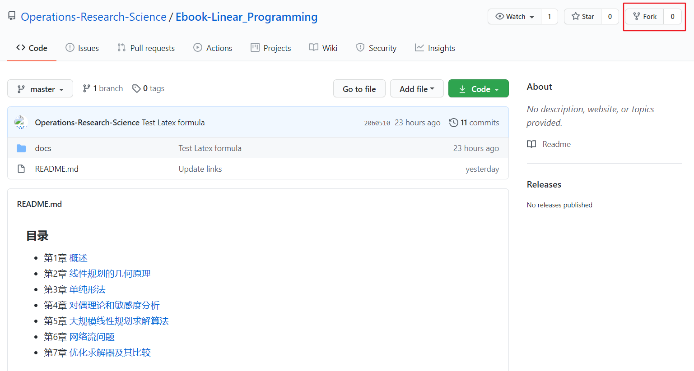

### 4.复制项目到本地

打开Github Desktop, 左上角File-Clone Repository，选择Ebook-Linear_Programming项目。

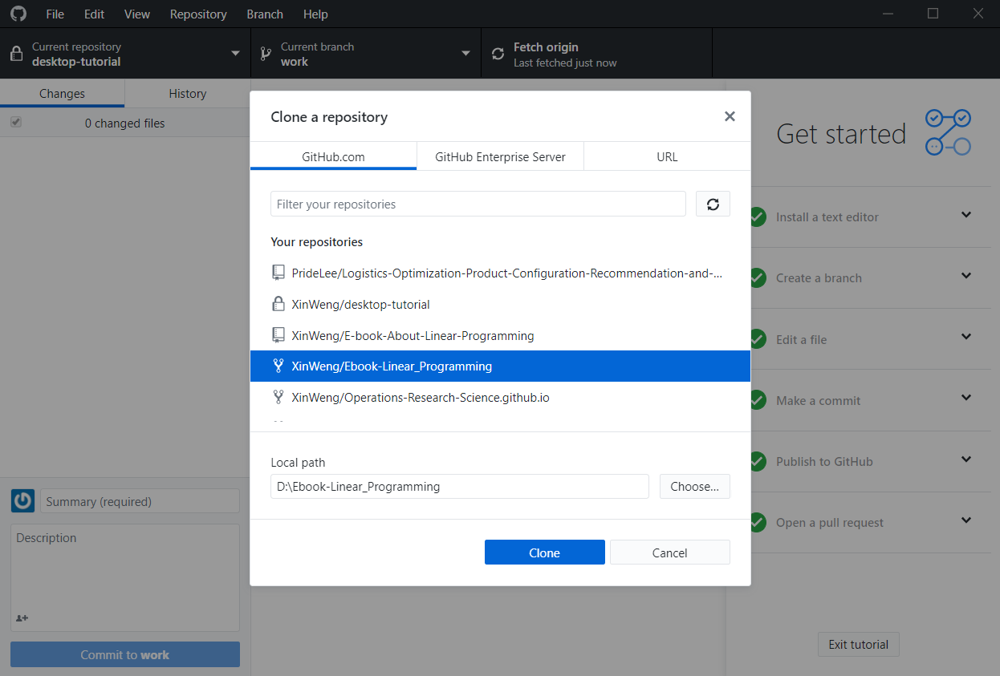

### 5.同步主账号内容到本地

其他人也可能向主账号提交了修改，需要及时把最新的版本同步到自己账号上。

打开cmd，切换到本地项目所在的文件夹。按序输入以下3个命令：

git fetch upstream

git merge upstream/master

git push origin master

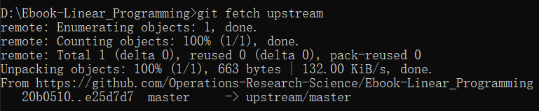

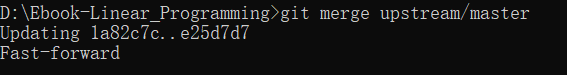

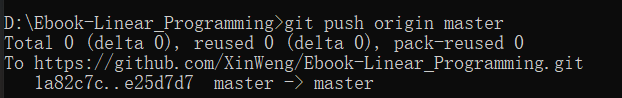

### 6.本地编辑内容

成功后，可以在本地文件夹里看到对应章节的md文件，替换为之前写好的文件。

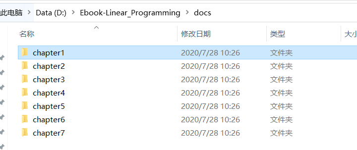

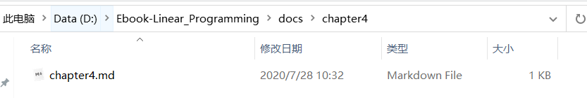

### 7.本地提交修改

在Github Desktop左侧可以查看到修改记录，左下角填写对此次修改内容的说明后，先点击"Commit to master"，再点击"Fetch origin (Push Origin)"。

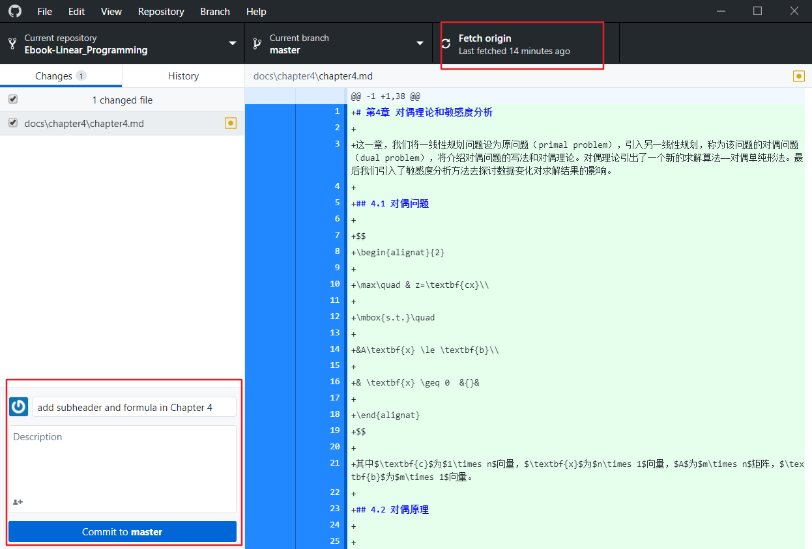

### 8.提交修改到主账号

打开Github网页版，可以看到更新内容。点击Pull requests-New pull request-Create pull request, 再次填写本次修改说明，点击Create pull request。

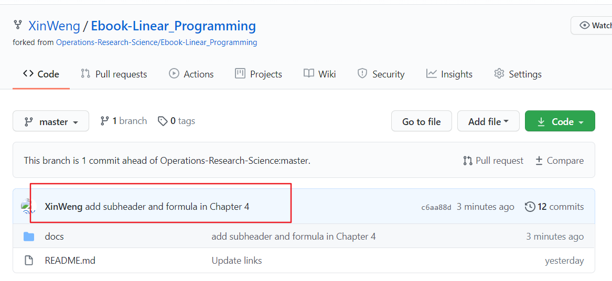

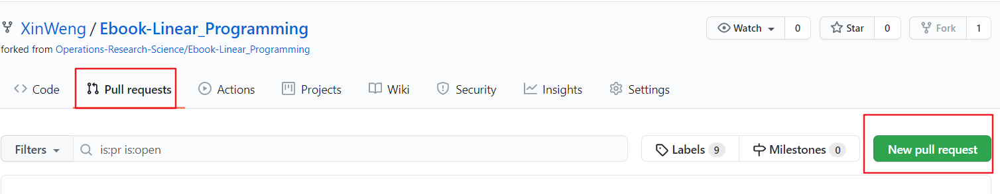

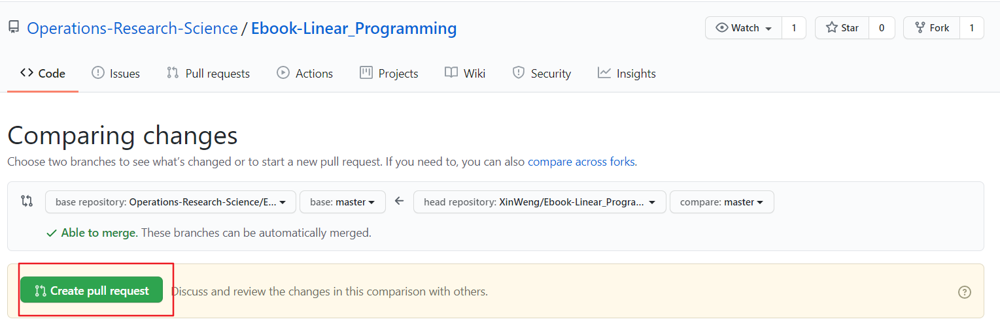

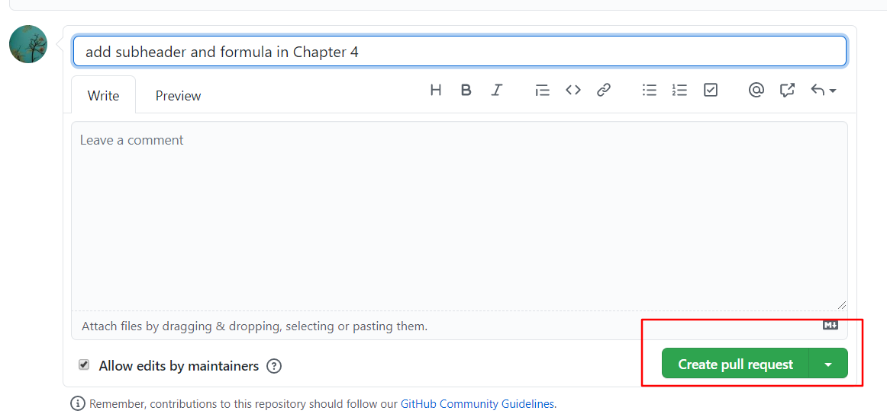

等待主账号通过修改申请，