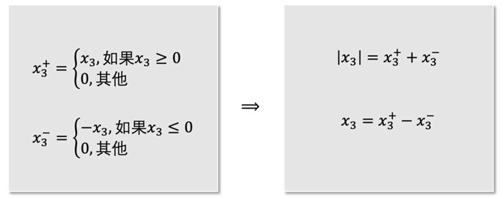
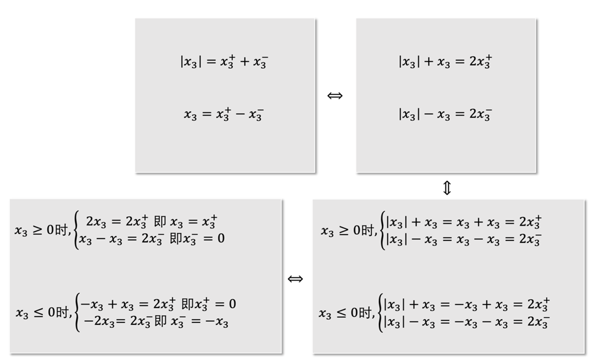
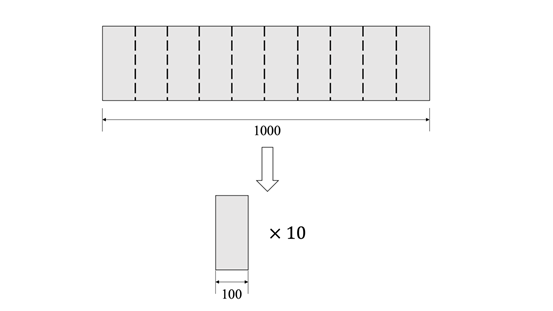

# 第1章 概述

作者：李崇楠，北京交通大学 交通运输规划与管理专业 研究生在读

研究方向：运输组织优化

​    本章带领读者走进线性规划的世界。首先介绍线性规划的历史，读者将了解到在线性规划领域作出杰出贡献的学者及其成就 ；接下来的内容为线性规划的基本概念 ，模型假设和“标准形”，并介绍了将一个般的线性规划模型转化为标准形的技巧；最后给出了若干线性规划案例。

## 1.1线性规划的历史

​    1939年，苏联学者Kantorovich为前苏联政府解决优化问题时提出了极值问题，并且提出了解乘数法的新方法，可惜他的工作在当时并未引起足够的重视。事实上，他所提出的问题正是线性规划的雏形。

​    与此同时，美国的线性规划却获得了飞快的发展。1941年，Hitchcock提出运输问题；1945年，Stigler提出了营养问题；1945年，Koopmans提出了经济问题。而奠定线性规划整套理论方法的，还要说是G.B.Dantzig，他被誉为“线性规划之父”。他在1947年担任美国空军审计官的数学顾问，为找到解决问题的机制化工具，提出了“在一组线性方程或不等式约束下，求某一线性形式极小值问题的数学模型”，这便是“线性规划”（linear programming）这一经典优化模型。而“线性规划”这一名字的由来是在之后1948年，Koopmans和Dantzig在海滩散步时共同想出的。1947年夏天，Dantzig提出了单纯形算法。这个算法在后来被评为20世纪最伟大的算法之一。

​    尽管单纯形法(Simplex method)作为解决线性规划的有效方法在学术界具有统治地位，但是1971年，Klee和Minty两位学者构造出一个例子，该例子下单纯形法的运作需要访问指数数量级别的顶点，也就是说，在最坏情况下，单纯形法是一个指数时间算法(exponential-time algorithm)。Dantzig在得知这个消息后感叹到他的噩梦到来了，单纯形法并不是在任何情况下都是高效可行的。那么，是否有更加高效的算法，比如多项式时间算法(polynomial-time algorithm)，来解决线性规划问题呢？8年后，即1979年，L.G.Khachiyan发明了椭球算法(ellipsoid method)，这是第一个解决线性规划问题的多项式时间算法。但是，这个算法虽然理论上是多项式时间运行，但是算法被证明是不切实际的，这个算法的杰出贡献是在理论层面告诉世人，线性规划是可以用多项式时间算法来解决的，同时也启发了学者在更加深入的优化领域进行算法开发。1984年，N.Karmarkar发明了内点算法(interior point method)，这是线性规划第一个实际可用的多项式时间算法。

## 1.2 线性规划模型

### 1.2.1 基本概念

​    线性规划是一类经典的优化模型。与一般的优化模型类型，线性规划模型也有目标函数，决策变量和约束条件。那决定这个优化模型是线性规划的因素是什么呢？下面我们将以一个例子展开介绍。
$$
\begin{alignat}{2}

\max\quad & x_1-2x_2  \quad &(1.1)

\\\\ \mbox{s.t.}\quad

 &x_1+x_2 \leq 40 \quad &(1.2) 

\\\\ & 2x_1+x_2 \leq 60 \quad &(1.3) 

\\\\ & x_1,x_2 \geq 0  \quad &(1.4)
\end{alignat}
$$
​    上述模型为典型的线性规划模型，式(1.1)是目标函数，$x_1,x_2$ 是决策变量，式(1.2)-(1.4)为约束条件，其中式(1.2)和式(1.3)为线性约束，式(1.4)为非负约束。可以发现，对线性规划模型而言，目标函数和约束条件都是线性函数。线性函数可以理解为每一项未知数(变量)的最高次数为1，即不会出现$x_1x_2$,$x_1^2$等未知数次数超过1的情况。

### 1.2.2 模型假设

​    线性规划作为一类数学模型，含有以下三种假设：

### 1.比例假设

​    在线性规划中，目标函数的系数是固定的常数，但是在现实生活中不见得如此，比如考虑目标函数是计算采购蔬菜计划的总花费。那么可能会面对“2元钱1个，3元钱2个”的这种促销，这时线性规划的目标函数就无法表示。

### 2.非负假设

​    线性规划的决策变量要求时非负数，但是不要求是非负整数，所以可以取小数。这同样有局限性，依然以采购蔬菜的问题为例，如果需要买土豆，但是土豆只能按整袋来卖的话，那么表示买土豆数量的决策变量就只能取整数了。

### 3.确定性假设

​    线性规划中像是目标函数的系数，线性约束中的常数与决策变量的系数，都是已知且保持不变的常数。但是有些参数在实际中是会变化的，通常参数变化的范围是已知的，这就涉及到鲁棒优化(robust optimization)、随机优化(stochastic optimization)等领域的内容了。

### 1.2.3 线性规划的标准形

​    在线性规划中，根据目标函数是试图取得最大还是取得最小，能够分成“最大化问题”与“最小化问题”两种问题。此外，线性约束根据决策变量的线性表达式和常数项之间的连接符为“大于等于”“等于”“小于等于”，又可以分为“大于等于约束”“等于约束”“小于等于约束”。因此，线性规划可以有不同的形式，这不利于定理、算法的表示及推导。为解决这一问题，引入线性规划的标准形。
$$
\begin{alignat}{2}

\max\quad & z = c_1x_1+c_2x_2+\cdots+c_nx_n  \\

\mbox{s.t.}\quad

&a_{11}x_1+a_{12}x_2+\cdots+a_{1n}x_n&=b_1  \\
&a_{21}x_1+a_{22}x_2+\cdots+a_{2n}x_n&=b_2  \\
& \quad \vdots \\
&a_{m1}x_1+a_{m2}x_2+\cdots+a_{mn}x_n &=b_m  \\
& x_1 \geq 0, x_2 \geq 0, \cdots, x_n \geq 0  
\end{alignat}
$$
​    观察上面的模型可以看到，线性规划的标准形具有如下特点：

（1）目标函数要取得最大值

（2）所有的决策变量都要满足非负约束（nonnegativity constraint）

（3）线性约束均为等式约束（equality constraint）

​    如果有一个非标准形的线性规划，那么如何等效地转化为标准形呢？这里要强调所谓“等效”的概念，即最优解是不变的，或转化后问题的最优解能够通过一定的方式推出原问题的最优解。

​    下面我们介绍将一个线性规划模型转换为标准形式的技巧。

## 1.3 线性规划标准形式的转换技巧

​    针对如下线性规划问题，我们将使用一些技巧，将它转化为线性规划模型的标准形式。
$$
\begin{alignat}{2}

\min\quad & 3x_1-2x_2-4|x_3|  \quad \\

\mbox{s.t.}\quad
&-x_1+2x_2\leq -5 \quad  \\
& 3x_2-x_3 \geq 6 \quad  \\
& 2x_1+x_3=12 \quad  \\
& x_1,x_2 \geq 0  \quad 
\end{alignat}
$$
​    与标准形进行对比，观察到有如下的差别：

（1）目标函数是最小化，而不是最大化。

（2）线性约束中有大于等于约束，有小于等于约束。

（3）决策变量$x_3$无约束，我们称之为自由变量。

（4）目标函数含有绝对值项，这是一个很难处理的要点，需要一定技巧才能化解。

​	下面逐一介绍转化为标准形的技巧。

### 1.目标函数最大化

​    针对目标函数是最小化的模型，我们可以将原问题的目标函数乘以负一，并最大化这个新的目标函数。在本例中，目标函数可以转化为
$$
\max\quad -3x_1+2x_2+4|x_3|
$$

### 2.消除不等式约束

​    我们可以看到第一个约束条件是“小于等于约束”，第二个约束条件是“大于等于约束”。在这里我们分别引入松弛变量（slack variable）进行转化。松弛变量均满足非负约束。对“小于等于约束”，我们加上一个松弛变量$s_1$；对“大于等于约束”，我们减去一个松弛变量 $s_2$。这样两个不等式约束都转换成了等式约束：
$$
-x_1+2x_2+s_1=-5
$$

$$
3x_2-x_3-s_2=6
$$

### 3.消除自由变量

​    在本例中，变量$x_3$没有约束。针对这类无约束变量，我们需要引入两个非负变量$x_3^+,x_3^-$来表示它：$x_3=x_3^{+}-x_3^-$ 但是这个例子的目标函数中，对$x_3$取绝对值，所以此处对$x_3$的转换还需要进一步的操作。

### 4.**消除绝对值符号**

​    在转换的时候，我们需要对绝对值符号内的项进行正负号判断，将原本含有绝对值符号的式子拆分成两个不含绝对值符号的式子。考虑到绝对值符号可能出现在目标函数中，也可能出现在约束条件中，接下来我们给出两种示例。

#### (1)目标函数中有绝对值符号

​    本例中目标函数值的第三项含有绝对值符号$|x_3|$,其中$x_3$为自由变量。我们引入两个变量$x_3^+,x_3^-$ ,定义为:
$$
\begin{equation}

x_3^+=

\begin{cases}

x_3&\mbox{if $x_3\geq0$}\\

0&\mbox{otherwise}

\end{cases}

\end{equation}
$$

$$
\begin{equation}

x_3^-=

\begin{cases}

-x_3&\mbox{if $x_3\leq0$}\\

0&\mbox{otherwise}

\end{cases}

\end{equation}
$$

​    由变量定义可知，$x_3^+,x_3^-$一定都是非负的，并且$x_3=x_3^+-x_3^-,|x_3|=x_3^++x_3^-$。 读者可以令$x_3$取某一具体的数值来验证。如当$x_3=4$时，$x_3^+=4,x_3^-=0,x_3=x_3^+-x_3^-=4-0=4,|x_3|=x_3^++x_3^-=4+0=4$; 当$x_3=-4$时，$x_3^+=0$,$x_3^-=4$,$x_3=x_3^+-x_3^-=0-4=-4$,$|x_3|=x_3^++x_3^-=0+4=4$。

#### (2)**约束条件中有绝对值符号** 

​    如有以下约束$|-x_1+2x_2|\leq7$。可以将其转化为：
$$
\begin{equation}

\begin{cases}

-x_1+2x_2\leq7&\mbox{if $-x_1+2x_2 \geq 0$}\\

x_1-2x_2\leq7&\mbox{if $-x_1+2x_2 \leq 0$}

\end{cases}

\end{equation}
$$

​    然后对上述式子添加松弛变量，转换成等式约束。

​    所以总结起来，我们可以把原线性规划问题转化为如下的标准形式：
$$
\begin{alignat}{2}

\max\quad & -3x_1+2x_2+4x_3^++4x_3^-+0s_1+0s_2  \quad \\

\mbox{s.t.}\quad
&-x_1+2x_2+s_1 = -5 \quad  \\
& 3x_2-x_3^++x_3^--s_2 = 6 \quad  \\
& 2x_1+x_3^+-x_3^-=12 \quad  \\
& x_1,x_2,x_3^+,x_3^-,s_1,s_2 \geq 0  \quad 
\end{alignat}
$$
​    为了让大家更加深入的理解之前引入的$x_3^+,x_3^-$这两个变量，我们去考察一下如下的等价性关系。如图1.1，左边灰色矩形框中的式子是可以推出右侧灰色矩形框的式子的。这在之前我们$x_3$分别取值为$4$和$-4$的实例中就可以看到。那么右边的式子是否可以反推得到左边的式子呢？我们来看图1.2的证明    

  
图1.1  “等价性”说明1

  
图1.2  “等价性”说明2

​    那么，之前定义的$x_3^+,x_3^-$是不是就完美无缺了呢？并不是。

​    请看下面这个线性规划模型：
$$
\begin{alignat}{2}

\min\quad & x_3  \quad \\

\mbox{s.t.}\quad
& |x_3| \leq 10 \quad  \\
& x_3 \geq -2 \quad  \\
\end{alignat}
$$
​    其中并没有非负约束。这个问题的最优解极其明显，就是$x_3=-2$。

​    我们将$x_3=x_3^+-x_3^-,|x_3|=x_3^++x_3^-$代入到上面的例子中，就有：
$$
\begin{alignat}{2}

\min\quad & x_3^+-x_3^-  \quad \\

\mbox{s.t.}\quad
& x_3^+-x_3^- \leq 10 \quad  \\
& x_3^+-x_3^- \geq-2 \quad  \\
& x_3^+,x_3^- \geq 0  \quad 
\end{alignat}
$$
​    这个问题读者现在可能不会求解，但是我们可以告诉读者。这个问题的最优解是$x_3^+=4$，$x_3^-=6$，$x_3^+-x_3^-=4-6=-2$。与原问题确实等价。但是，细心的读者会发现，此时计算$x_3^+x_3^-=4+6=10\neq|-2|=2$。原因是，由$x_3^+,x_3^-$的定义可以知道，$x_3^+$,$x_3^-$不能同时取正数，至少有一个为$0$ (当$x_3=0$时，$x_3^+$与$x_3^-$同时取值为零)。所以说，$x_3^+,x_3^-$的取值分别为$0$和$2$才是一个完全符合定义的最优解。

​    那么，为什么会出现这样的情况呢？实际是有一个隐含的二次约束(quadratic constraint)被忽略掉了，即$x_3^+\times x_3^-=0$，如果有了它，那么得到的$x_3^+,x_3^-$就会满足“至少有一个为0”的条件。读者会问，这有什么用吗，我求出来$x_3^+=4$，$x_3^-=6$，还是能得到最优解是$x_3=-2$。事实上，大多数情况下，确实没必要苛求“至少有一个为0”的条件。所以通常转化中，我们也不要求非要引入这样的二次约束。

## 1.4线性规划案例

### 1.4.1 资源分配生产问题

​    某军工厂生产甲、乙、丙三种产品，生产三种产品需要A、B两种资源，其单位需求量及利润由下表1给出，问每天生产甲、乙、丙三种产品各多少，可使总利润最大？

  
表1.1  资源分配生成问题信息

| 甲   |      | 乙   | 丙   | 资源的最大量 |
| ---- | ---- | ---- | ---- | ------------ |
| 2    | A    | 3    | 1    | 100kg        |
| 3    | B    | 3    | 2    | 120kg        |
| 40元 | 利润 | 45元 | 24元 |              |

​    这个问题的解决需要建立线性规划模型，用三个变量$x_1,x_2,x_3$代表每天生产甲、乙、丙产品的数量（假设决策变量）。题干提到要使“总利润最大”，所以建立目标函数：
$$
z=40x_1+45x_2+24x_3
$$
​    目标函数的含义就是总利润的大小，那么函数值自然越大越好，但是需要考虑题干中提到的各种限制，也就是约束条件。因此，可以写出如下的约束条件：
$$
\begin{equation}

\begin{cases}

2x_1+3x_2+x_3\leq100&\mbox{使用A资源不能超过给定总量}\\
3x_1+3x_2+2x_3\leq120&\mbox{使用B资源不能超过给定总量}\\
x_1\geq0,x_2\geq0,x_3\geq0 &\mbox{甲、乙、丙三种产品数量是非负数}

\end{cases}

\end{equation}
$$
​    经过三个步骤：假设决策变量、建立目标函数、寻找约束条件，我们就得到了如下的线性规划模型：
$$
\begin{alignat}{2}

\max\quad & z=40x_1+45x_2+24x_3 \quad \\

\mbox{s.t.}\quad
& 2x_1+3x_2+x_3\leq100 \quad  \\
& 3x_1+3x_2+2x_3\leq120 \quad  \\
& x_1\geq0,x_2\geq0,x_3\geq0   \quad 
\end{alignat}
$$
​    只要解出满足这个模型的约束同时使目标函数最大的$x_1,x_2,x_3$即为最终答案。

### 1.4.2 营养问题

​     一个健身人士需要购买A、B两种食品，已知食品含有营养成份1、2、3的数量及每日人体对该三种成份的必需量如表2所示，请问他应当每天分别购买多少A、B食品，使得在满足要求的情况下总费用最少？

  
表1.2  营养信息

|          | A     | B    | 每日该成份最低摄入量 |
| -------- | ----- | ---- | -------------------- |
| 成份1    | 10    | 4    | 20mg                 |
| 成份2    | 5     | 5    | 20mg                 |
| 成份3    | 2     | 6    | 12mg                 |
| 食品价格 | 0.6元 | 1元  |                      |

​    本问题仿照例一，应当先假设决策变量，设$x_1$为每天购买食品A的量，设$x_2$为每天购买食品B的量。 下一步为建立目标函数，这个题目要求我们尽可能让健身人士少花钱，也就是总花费最小，所以有:$\min z=0.6x_1+x_2$ 。 最后一步就是考虑约束条件，本例要求每天摄入三种营养成分的数量应至少达到表1.2中要求的最低摄入量，所以有：
$$
\begin{equation}

\begin{cases}

10x_1+4x_2\geq20&\mbox{成份1需满足最低摄入量要求}\\
5x_1+5x_2\geq20&\mbox{成份2需满足最低摄入量要求}\\
2x_1+6x_2\geq12&\mbox{成份3需满足最低摄入量要求}\\
x_1\geq0,x_2\geq0 &\mbox{A,B两种食品数量是非负数}

\end{cases}

\end{equation}
$$
​    所以得到如下的线性规划模型：
$$
\begin{alignat}{2}

\min\quad & z=0.6x_1+x_2 \quad \\

\mbox{s.t.}\quad
&10x_1+4x_2\geq20\\
&5x_1+5x_2\geq20\\
&2x_1+6x_2\geq12\\
&x_1\geq0,x_2\geq0 
\end{alignat}
$$
​    同理，只要解出满足这个模型的约束同时使目标函数最小即总花费最小的$x_1,x_2$即为最终答案。

### 1.4.3卷钢问题

​    卷钢问题又称为下料问题，这个问题严格来讲不能算是“线性规划”的内容，而是“整数规划”的内容，所谓整数规划，读者可以理解为是在线性规划的基础上，给决策变量加上整数限制，即决策变量必须是整数，这比线性规划的求解难度要大得多。但是这个问题在建模的角度上又是一个非常典型的问题，所以特此介绍。

​    本例采用卷钢问题中最简单的一种，也就是一维卷钢问题。 有一个卷钢加工工厂，现在有100个卷钢，每个卷钢(roll)的宽度都是1000。 现在有5个客户，每个客户都需要一定数量的零件(item)，这些零件都可以通过卷钢切割加以生产。 比如说1号客户需要5个宽度为100的零件，那么工厂可以按照图1.3的方式进行生产。 2号客户需要4个宽度为150的零件；3号客户需要14个宽度为375的零件；4号客户需要7个宽度为800的零件；5号客户需要3个宽度为50的零件。

  
图1.3  一种切割方式

​    现在的问题是，如何安排使用卷钢数量最少的切割计划，使得所有客户的需求能够满足，同时还要考虑到卷钢的宽度是有限制的。

​    下面我们建立问题的模型，第一步为假设决策变量。 考虑到工厂一共有1000个卷钢，面对5个客户的需求，不一定所有的卷钢都要得到使用，所以我们引入一种取值仅为0或1的决策变量 $y_k$，其中$k=1,\cdots,1000$表示第$k$个卷钢。 如果$y_k$ 取1，表示 $k$号卷钢被用来切割零件；如果  取0，表示  号卷钢没有被用来切割零件。 题干要求我们安排使用卷钢数量最少的切割计划，因此我们的目标函数其实就是$\sum_{k=1}^{1000} y_k$。除了$y_k$，我们还要引入一个决策变量，它也是取值为非负整数，但是不局限于0和1，而是所有非负整数，它就是$x_i^k$, 其中$i=1,\cdots,5$表示第$i$位客户，或者说第$i$种零件。 这个决策变量的含义是在$k$号卷钢上切下第$i$种零件的个数。 由于目标函数已经建立完成，所以建模只剩下考虑约束条件了。 第一类约束条件是所有客户的需求要得到满足，这里有5个客户，所以有5条约束，我们用符号$n_i$表示客户$i$需要的零件个数，那么我们就有$sum_{k=1}^{1000}x^k_i\geq n_i$,$i=1,\cdots,5$。第二类约束条件是在每个卷钢上的切割方案需要考虑到卷钢总宽度的限制，但是不一定1000个卷钢都要拿来投入生产用以满足这5位客户的要求，也就是说有一些卷钢不会进行切割，那么如何表达这一事实呢，我们其实可以引入刚才使用的决策变量  $y_k$，那么约束就为:$\sum_{i=1}^5 w_ix^k_i\leq Wy_k$，这一类约束共有1000个，其中$w_i$为零件$i$的宽度。 综上，卷钢问题的模型如下所示：
$$
\begin{alignat}{2}

\min\quad & \sum_{k=1}^{1000} y_k \quad \\

\mbox{s.t.}\quad
&\sum_{k=1}^{1000} x_i^k \geq n_i, \quad i=1,\cdots,5\\
&\sum_{i=1}^5 w_ix_i^k\leq Wy_k, \quad k=1,\cdots,1000\\
&x_i^k \in \mathbb Z^+ \cup \{ 0 \}, y_k \in \{ 0,1 \}, \quad i=1,\cdots,5, k=1,\cdots,1000
\end{alignat}
$$
​    该问题实际上并不是线性规划，因为决策变量加上了必须为整数这一约束，这其实是整数规划问题，这个问题的模型最早是前苏联的学者Kantorovich建立的。 这个模型虽然非常清晰地描述了一维卷钢问题，但是直接求解这个模型效率非常低，后来Gomory针对此问题建立了其他版本的模型，并应用著名的列生成算法(column generation)进行高效求解，这些内容就不在这里展开描述了，读者感兴趣的话可以阅读本书第5章列列生成算法部分。

## 本章参考文献

[1] 马国瑜. 线性规划的发展历史[J]. 北京化工大学学报(自然科学版), 1985(4):27-33.

[2] SC Fang. Linear Optimization and Extensions – Theory and Algorithms[M]. Prentice-Hall, Inc,1993, 1-9.