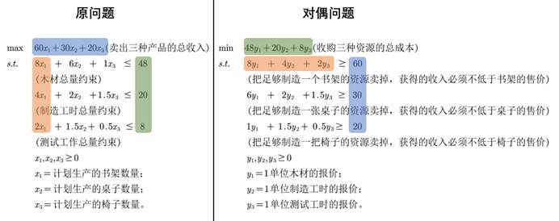
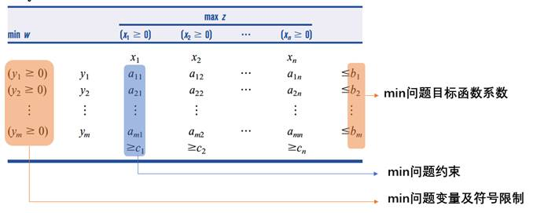
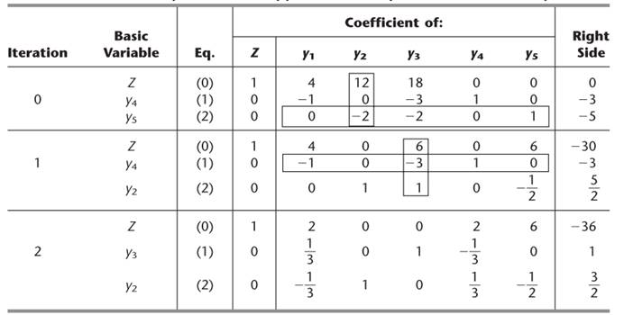
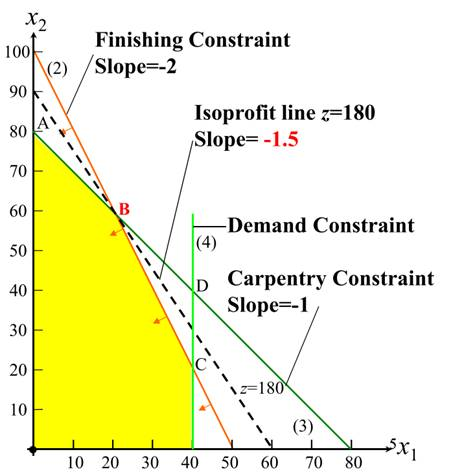
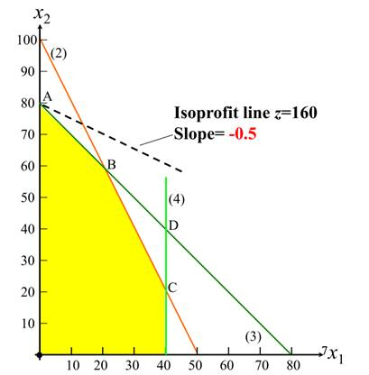

# 第4章 对偶理论和敏感度分析

作者：翁欣，清华大学博士在读

研究方向：供应链优化，服务运营，随机优化

这一章，我们将一线性规划问题设为原问题（primal problem），引入另一线性规划，称为该问题的对偶问题（dual problem），将介绍对偶问题的写法和对偶理论。对偶理论引出了一个新的求解算法——对偶单纯形法。最后我们引入了敏感度分析方法去探讨数据变化对求解结果的影响。

## 4.1 对偶问题

### 4.1.1 对偶问题的理解

线性规划里，每个原始线性规划问题，即**原问题（primal problem）**都有相应的另一个线性规划问题——**对偶问题（dual problem）**，而对偶的对偶又是原问题本身。既然我们已经知道用单纯形法去求解原问题了，为什么还要了解它的对偶问题呢？哪些情况下，考虑对偶问题有助于求解原问题？下面我们从两个角度阐述。

**1.经济学角度**

这是一个在教材上被广泛使用的解释：如果原问题是企业A拥有m种资源（有m个约束），计划生产n种产品（有n个变量），目标是最大化总收入；那么对偶问题就是，企业B想要收购这些资源，需要确定m种资源的报价（有m个变量），目标是最小化总成本，但企业A只有在卖资源的收益不低于卖产品的时候才会同意卖资源（n个约束）。

我们通过一个数值实例来进一步解释：

企业A生产书架、桌子和椅子三种产品，拥有48m³木材，20h制造工时，8h测试工时三项资源。已知：书架售价60元，生产一个书架需要8单位木材、4单位制造工时和2单位测试工时；桌子售价30元，生产一张桌子需要6单位木材、2单位制造工时和1.5单位测试工时；椅子售价20元，生产一把椅子需要1单位木材、1.5单位制造工时和0.5单位测试工时；求三种产品各生产多少数量时，企业A能够最大化总收入。

**原问题**的线性规划为：
$$
\begin{alignat}{2}\max\quad  & 60x_1+30x_2+20x_3 \nonumber（卖出三种产品的总收入） 
\\\\\text{s.t.}\quad & 8x_1+6x_2+x_3\le48 \nonumber（木材总量约束）
\\\\ \quad & 4x_1+2x_2+1.5x_3\le20 \nonumber （制造工时总量约束）
\\\\ \quad & 2x_1+1.5x_2+0.5x_3\le8  \nonumber（测试工时总量约束）
\\\\ \quad &x_1,x_2,x_3\ge0 \nonumber
\\\\\end{alignat}
$$
如果企业B想要收购木材、制造工时、测试工时这三样资源，就必须为每项资源报价，并且满足企业A愿意出让资源的条件，即让企业A获得不低于自己制造产品的收入。求三项资源的单位报价各为多少时，企业B能够最小化总成本。

那么，可以写出**对偶问题**的线性规划是：
$$
\begin{alignat}{2}\min\quad  & 48y_1+20y_2+8y_3 \nonumber（收购三种资源的总成本） 
\\\\\text{s.t.}\quad & 8y_1+4y_2+2y_3\ge60 \nonumber（把足够制造一个书架的资源卖掉，获得的收入必须不低于书架售价）
\\\\ \quad & 6y_1+2y_2+1.5y_3\ge30 \nonumber（把足够制造一张桌子的资源卖掉，获得的收入必须不低于桌子售价）
\\\\ \quad & y_1+1.5y_2+0.5y_3\ge20 \nonumber（把足够制造一把椅子的资源卖掉，获得的收入必须不低于椅子售价）
\\\\ \quad &y_1,y_2,y_3\ge0 \nonumber（分别是一单位木材、制造工时和测试工时的报价）
\\\\\end{alignat}
$$
上面的例子，旨在从实际经济问题的角度解释**「每一个线性规划问题都存在一个与其对偶的问题」**这句话的合理性。

**2.数学角度**

从数学角度，对偶问题可以被理解为**寻找原问题目标函数上界（或下界）**的问题。

以原问题是求**目标函数最大化**为例，我们以向量形式写线性规划：
$$
\begin{alignat}{2}\max\quad  z=\textbf{cx} \nonumber
\\\\\text{s.t.}\quad A\textbf{x} \le \textbf{b} \nonumber
\\\\\textbf{x} \geq 0  \nonumber &{}& 
\\\\\end{alignat}
$$
其中$\textbf{c}$为$1\times n$向量，$\textbf{x}$为$n\times 1$向量，$A$为$m\times n$矩阵，$\textbf{b}$为$m\times 1$向量。

对于任意一个非负的$n\times1$向量$\textbf{y}\ge0$和可行解$\textbf{x}$，原问题约束两边同乘$\textbf{y}^T$，有：
$$
\textbf{y}^TA\textbf{x} \le \textbf{y}^T\textbf{b}
$$
如果找到一个$\textbf{y}^T$满足$\textbf{c}\le\textbf{y}^TA$$，那么对所有可行解$$\textbf{x}$，都有：
$$
\textbf{cx}\le\textbf{y}^TA\textbf{x}\le\textbf{y}^T\textbf{b}
$$
这意味着，$\textbf{y}^T\textbf{b}$就是**原问题的一个上界**。

换言之，所有满足$\textbf{c}\le\textbf{y}^TA$$的$$\textbf{y}$$对应的$$\textbf{y}^T\textbf{b}$，都是原问题的上界。

那么，最小的上界就是原问题目标函数的最优值。在所有的上界中，我们要找到最小的那一个，这个问题表述出来就是：
$$
\begin{alignat}{2}\min\quad w=\textbf{b}^T\textbf{y}  \nonumber
\\\\\text{s.t.}\quad A^T\textbf{y} \ge \textbf{c}^T  \nonumber
\\\\\textbf{y} \geq 0  \nonumber
\end{alignat}
$$
可以发现，**这就是对偶问题的形式**。反之，如果原问题是求目标函数最小化，那么对偶问题就是在寻找原问题目标函数的下界。图4.1可以帮助理解：26是目标函数最优值，两个问题**分别从左右两侧逼近最优值**。

图4.1 原问题和对偶问题从两侧逼近最优解

3.**结合两个角度的解释**

依然从刚才的例子出发，现在有一组生产方案满足原问题约束，对应企业A总收入是$\bar{z}$；有一组报价满足对偶问题约束，对应企业B总成本是$\bar{w}$。

一定有$\bar{z}\le\bar{w}$，也就是企业B付出的总成本一定不低于企业A的总收入（这是对偶问题的约束，所以一定成立）。

也就是说，在这个例子里，对偶问题的任意一个可行解，都是原问题的一个上界。因为企业B用这组报价可以买到资源，所以企业A制造产品的收入不可能高于这组报价对应的成本。

当我们找到企业B所有报价里总成本最低的那一组，就是企业A能获得的总收入的最大值，是原问题的最优解。

### 4.1.2 对偶问题的优势

接下来我们考虑，同样是求解线性规划，解对偶问题就会比解原问题更容易吗？或者说，什么情况下，考虑对偶问题有助于求解原问题？

**1.**   **原问题约束多、变量少时，求解对偶问题能够降低计算时间**。

使用单纯形法时，如果原问题约束多变量少，转换成对偶问题，就是约束少变量多。根据单纯形法的原理，约束的减少能够有效降低计算时间。

**2.**   **帮助证明原问题无解**。

类似“证明无罪比证明有罪更难”，要证明原问题有解，只需要找出一个满足约束的点，却不能通过遍历所有的点来证明原问题无解。对偶问题的出现为证明原问题无解提供了思路。

**3.**   **便于进行敏感度分析**。

很多时候我们对原问题的好奇心并不仅限于得到最优解，而是还关注「如果某些已知条件发生变化，对最优解的影响程度如何」，这就是敏感度分析。对偶问题和敏感度分析息息相关：一是增加敏感度分析的直观程度（例如，对偶问题的最优解就是原问题约束的影子价格），二是在改变某些条件导致原问题无可行解时，可以借助仍然有可行解的对偶问题来分析。

### 4.1.3 对偶问题的表达

上两小节我们解释了「**为何引入对偶问题**」，这一节将阐述**对偶问题的表达**，即已知原问题时，如何快速写出对偶问题。先介绍一般形式的对偶问题写法，再介绍如何将非一般形式转化为一般形式，最后总结。

**1.**   **一般形式的对偶问题**

以目标函数最大化问题为例，**原问题的一般形式**指的是变量全部非负、约束全部为小于等于约束的线性规划，向量形式如下：
$$
\begin{alignat}{2}\max & \quad  z=\textbf{cx} \nonumber
\\\\\text{s.t.}&  \quad A\textbf{x} \le \textbf{b} \nonumber
\\\\ &\quad  \textbf{x} \geq 0  \nonumber 
\end{alignat}
$$
根据上一小节内容，其对偶问题的含义是：在原问题目标函数的所有上界中，找到最小的一个。相应**对偶问题的一般形式**，指的是变量全部非负、约束全部为大于等于约束的线性规划，向量形式如下：
$$
\begin{alignat}{2}\min & \quad  w=\textbf{b}^T\textbf{y} \nonumber
\\\\\text{s.t.}& \quad A^T\textbf{y} \ge \textbf{c}^T \nonumber
\\\\ & \quad \textbf{y} \geq 0  \nonumber
\end{alignat}
$$
在向量形式中，可以直观看出原问题和对偶问题的系数存在对应关系，例如：原问题目标函数的系数向量的转置$\textbf{c}^T$，是对偶问题约束的右侧向量，原问题中约束条件中的向量$\textbf{b}$则出现在对偶问题的目标函数中；原问题约束的系数矩阵的转置$A^T$，是对偶问题约束的系数矩阵。借用上一节的实例，对应关系如图4.2： 

图4.2 原问题与对偶问题对应关系

如果我们面对的是一般形式问题，可以使用**表格法**便捷地写出对偶问题。图4.3中，**由上至下按行读**是**原问题**的约束和目标函数，**由左至右按列读**是**对偶问题**的约束和目标函数。

(a) 标示max问题

(b) 标示min问题

图4.3 表格法写对偶问题

**2.**   **非一般形式的对偶问题**

实际中我们常常会遇到非一般形式的线性规划问题，在应用表格法之前需要先**对变量和约束的形式进行转化**（以目标函数最大化问题为例）：

①如果有$\ge$约束，则左右同乘-1，转化为$\le$约束；

②如果有$=$约束，则先转换为一个$\le$约束和一个$\ge$约束，再按①把$\ge$约束转换为$\le$约束。例如，如果存在约束$x_1+x_2=2$，等价于同时满足$x_1+x_2 \le 2$和$x_1+x_2\ge2$，后者再写成$-x_1-x_2\le-2$。

③如果有无符号限制(unrestricted in sign, **urs**)的变量，用两个符号限制为$\ge0$的变量相减表示，转换关系为：$x(x\quad \textbf{urs})=x^{'}-x^{''}(x^{'},x^{''}\ge0)$。

**3.   总结**

将原问题转换为对偶问题的通用步骤归纳如下：①将原问题转换为标准形式；②由上至下逐行写原问题一般形式的变量及符号限制、约束和目标函数；③根据对应关系表确定对偶问题的**约束符号和变量符号**；④由左至右逐列读，得到对偶问题的变量及符号限制、约束和目标函数。

表格法中，**原问题和对偶问题的符号对应关系**可参考表4.1。（由于对偶的对偶是原问题，所以当原问题是最小化问题时，对应关系同样适用）

表4.1 原问题与对偶问题对应关系

| **原问题**       |                         |                           | **对偶问题**     |
| ---------------- | ----------------------- | ------------------------- | ---------------- |
| 变量向量         | $\textbf{x}(n\times1)$  | $\textbf{y}(m\times1)$    | 变量向量         |
| 目标函数方向     | max                     | min                       | 目标函数方向     |
| 目标函数系数向量 | $\textbf{c}(1\times n)$ | $\textbf{b}^T(1\times m)$ | 目标函数系数向量 |
| 约束系数矩阵     | $A(m\times n)$          | $A^T(n\times m)$          | 约束系数矩阵     |
| 约束右侧常数向量 | $\textbf{b}(m\times 1)$ | $\textbf{c}^T(n\times 1)$ | 约束右侧常数向量 |
| 变量符号         | $\ge0$                  | $\ge c_i$                 | 约束符号         |
|                  | $\le0$                  | $\le c_i$                 |                  |
|                  | urs                     | $=c_i$                    |                  |
| 约束符号         | $\le b_i$               | $\ge 0$                   | 变量符号         |
|                  | $\ge b_i$               | $\le 0$                   |                  |
|                  | $=b_i$                  | urs                       |                  |

本章到目前已经回答了「**为什么要引入对偶问题**」以及「**如何写对偶问题**」，下一节的主题是对偶原理，回答的问题是「**为什么原问题和对偶问题具有相同的最优解**（在有最优解的前提下）」，在证明的过程中，也会发现线性规划的一些其他性质。

## 4.2 对偶原理

这一节着重讲述**原问题和对偶问题的解之间的关系**，即对偶原理。通过对偶原理，我们可以更好地理解如何借助对偶问题的解获得原问题的解。本节先概述**弱对偶定理、强对偶定理和互补松弛定理**的内容，再逐个进行说明。

以原问题是最大化问题为例，**弱对偶定理**是与可行解相关的一个定理：**当对偶问题有任一可行解$\textbf{y}_0$时，其相应的对偶问题目标函数值$w_0$是原问题目标函数值的上界**。换句话说，对原问题任一可行解$\textbf{x}_0$对应的原问题目标函数$z_0$，一定有$z_0\le w_0$成立。在4.1.1节解释为什么每一个线性规划都一定存在对偶问题时，我们已经简单说明过这一定理，接下来将在4.2.1节给出更详细的证明。

**强对偶定理**则与最优解相关：**当已知原问题最优解时，对偶问题也一定有最优解，且两个问题最优解的目标函数值相等**。

当原问题和对偶问题各自有一个可行解$\textbf{x}_0$和$\textbf{y}_0$时，要判断$\textbf{x}_0$和$\textbf{y}_0$是否为最优解，就涉及**互补松弛定理**：$\textbf{x}_0$和$\textbf{y}_0$分别为原问题和对偶问题最优解的充要条件是，
$$
\textbf{y}_0\textbf{s}=\textbf{y}_0(A\textbf{x}_0-\textbf{b})=0
\\\\\textbf{x}_0^T\textbf{e}=\textbf{x}_0^T(A^T\textbf{y}_0-\textbf{c}^T)=0
$$
其中$\textbf{s}$和$\textbf{e}$分别为原问题和对偶问题的松弛变量(slack variables)和剩余变量(excess variables)。

借助这些定理，**给出对偶问题的最优解，便可求得原问题的最优解；给出对偶问题的可行解，也可限定原问题最优解的范围**，反之亦然。接下来对每个定理进行详细说明。

### 4.2.1 弱对偶定理

以原问题是最大化问题为例，原问题和对偶问题的一般形式见4.1.3节。

已知原问题和对偶问题各自有一个可行解$\textbf{x}_0$和$\textbf{y}_0$。由于$\textbf{y}_0$为非负向量，因此在原问题约束两边同乘$\textbf{y}_0$，得到以下公式，对任意$\textbf{x}$都成立：
$$
\textbf{y}_0^TA\textbf{x}\le\textbf{y}_0^T\textbf{b}
$$
同理，在对偶问题约束两边同乘$\textbf{x}_0$，得到以下公式，对任意$\textbf{y}$都成立：
$$
\textbf{x}_0^TA^T\textbf{y} \ge \textbf{x}_0^T\textbf{c}^T \Longleftrightarrow  \textbf{y}^TA\textbf{x}_0\ge\textbf{cx}_0
$$
对以上两个公式，分别代入$\textbf{x}_0$和$\textbf{y}_0$后合并，得到：
$$
\textbf{cx}_0 \le \textbf{y}_0^TA\textbf{x}_0 \le \textbf{y}_0^T\textbf{b}  \Longleftrightarrow  z_0 \le w_0
$$
即原问题目标函数$z_0$一定不高于对偶问题目标函数$w_0$，弱对偶定理得以证明。

基于弱对偶定理，还可以得到**两个推论**：

1. （最优性）如果原问题和对偶问题各自有一个可行解$\textbf{x}_0$和$\textbf{y}_0$，且相应的目标函数值$z_0=w_0$，那么$\textbf{x}_0$和$\textbf{y}_0$分别是原问题和对偶问题的最优解。

2. 如果原问题的解无界(unbounded)，那么对偶问题无可行解；如果原问题无可行解，那么对偶问题的解无界。

### 4.2.3  强对偶定理

强对偶定理的完整表述是：如果$BV$是原问题的一组最优基，那么$\textbf{c}_{BV}B^{-1}$是对偶问题的一组最优解，$\textbf{c}_{BV}B^{-1}\textbf{b}$是原问题和对偶问题最优解对应的目标函数值。

其证明思路分为三步：

1. 已知$BV$是原问题的一组最优基，证明$\textbf{c}_{BV}B^{-1}$是对偶问题的一组可行解。此时**原问题和对偶问题各有一组可行解**。

2. 证明$\textbf{c}_{BV}B^{-1}$对应的对偶问题目标函数值等于$BV$对应的原问题目标函数值，即**两组可行解的目标函数值相同**。

3. 前两步的证明结果恰好是**弱对偶定理最优性推论**的条件，因此可以推出**这两组可行解分别是原问题和对偶问题的最优解**。

### 4.2.3 互补松弛定理

互补松弛定理是关联原问题和对偶问题解的重要定理，在证明之前，首先定义原问题的松弛变量$\textbf{s}$和对偶问题的剩余变量$\textbf{e}$。

已知$\textbf{x}_0$是原问题的一个可行解，松弛变量$\textbf{s}$描述的是$\textbf{x}_0$代入原问题时约束的“松弛”程度。将约束$A\textbf{x}\le\textbf{b}$右边的常量$\textbf{b}$理解为资源，**当约束是以等号成立时，说明此时资源正好全部用完，没有富余；当约束时以不等号成立时，说明此时资源还没有被全部利用，存在富余，有一定的“松弛”**。同理，剩余变量$\textbf{e}$描述的是对偶问题约束$A^T\textbf{y}\ge\textbf{c}^T$的“剩余”程度，两者的计算公式如下：
$$
\textbf{s}=A\textbf{x}_0-\textbf{b}
\\\\ \textbf{e}=A^T\textbf{y}_0-\textbf{c}^T
$$
**互补松弛定理**的内容是，可行解$\textbf{x}_0$和$\textbf{y}_0$分别为原问题和对偶问题最优解的**充要条件**是
$$
\textbf{y}_0\textbf{s}=0 \\\\ \textbf{x}_0^T\textbf{e}=0
$$

第一个公式有两种成立情况，分别可以用文字表述为：

- 原问题第i个松弛变量大于0，此时对偶问题第i个变量等于0；
- 对偶问题第i个变量大于0，此时原问题第i个松弛变量等于0；

第二个公式同样有两种成立情况，用文字表述为：

- 对偶问题第j个剩余变量大于0，此时原问题第j个变量等于0；
- 原问题第j个变量大于0，此时对偶问题第j个剩余变量等于0。

上述四种情况意味着，**如果原问题/对偶问题中任一个约束时是以非等号形式成立的**（nonbinding，不具约束力，即$\textbf{s}_i$或$\textbf{e}_j$大于0），**那么在对偶问题/原问题中该约束对应的变量就一定为0**，因此这一定理称为互补松弛。通过互补松弛定理，给出原问题的最优解，便可求得其对偶问题的最优解，反之亦然。

本节介绍了弱对偶定理、强对偶定理和互补松弛定理，阐述了原问题和对偶问题的解之间的关系。下一节「对偶单纯形法」将进一步利用这些关系，介绍利用对偶可行性逐步搜索出原始问题最优解的方法。

## 4.3 对偶单纯形法

第三章介绍了求解线性规划问题的经典算法——单纯形法，这一节介绍另一种求解算法——对偶单纯形法。这一方法基于对偶原理，利用对偶可行性逐步搜索出原始问题最优解。本节先概述对偶单纯形法的原理、优点，再介绍具体求解步骤和一个算例。

### 4.3.1 基本思想

在4.1节中我们提到过，原问题和对偶问题是**分别从左右两侧逼近最优值**。以图4.1为例，左侧是对偶问题的可行解，右侧是原问题的可行解，当两个可行解有相同的目标函数值时（图中的26），这两个解分别是原问题和对偶问题的最优解。

单纯形法是先找到原问题可行解，再通过努力实现对偶可行性（最优性检验）找到最优解。对偶单纯形法可以看作是**单纯形法的镜像**，先找到对偶问题可行解，再通过努力实现原问题可行来靠近最优解。也可以理解为，我们是**把单纯形法应用在对偶问题**。

对偶单纯形法在某些特殊情况下比单纯形法更方便：

1. 需要引入多个人工变量来构造原问题可行解时，找到对偶问题可行解可能更容易一些，找到最优解的迭代次数也可能更少。

2. 对偶单纯形法可以与敏感度分析结合使用。假设用单纯形法得到了一个最优解，但需要对数据做一些小修改。在新的条件下，如果原来的最优解不再是原问题可行解，但仍然满足最优性检验，则可以从对偶可行解开始应用对偶单纯形法，更快找到新问题最优解。

3. 在求解某些大型线性规划问题时，对偶单纯形法也有一定的实用价值。CPLEX计算经验表明，对偶单纯形法在解决实际中遇到的大型线性规划问题时通常比单纯形方法更有效。

### 4.3.2 求解步骤

对偶单纯形法的规则与单纯形法的规则非常相似，区别就是选择进入变量(entering variable)和离开变量(leaving variable)的标准以及停止算法的标准不同。

以目标函数最大化问题为例，具体求解步骤如下。

**步骤1 初始化**

所有约束转化为$\le$形式；找到一个基本解，使得目标函数中基本变量的系数为0，非基本变量的系数非负（这样如果这个解是可行的，则可保证它是最优的）。

**步骤2 可行检验**

检验是否所有的基本变量都为非负。如果是，那么这一解是可行解，也是最优解，算法结束。否则，进行迭代。

**步骤3 迭代**

1）确定离开变量：在值为负的基本变量中，选择绝对值最大的。

2）确定进入变量：在包含离开变量的约束中选择系数为负的非基本变量，进而在其中选择（目标函数系数/在该约束中的系数）比值绝对值最小的。

3）确定一个新的基本解，返回步骤2检验。

**例题4.1** 用对偶单纯形法解下列问题：
$$
\begin{alignat}{2}\max & \quad  z=-4y_1-12y_2-18y_3 \nonumber
\\\\\text{s.t.} & \quad -y_1-3y_3+y_4=-3 \nonumber
\\\\ & \quad -2y_2-2y_3+y_5=-5 \nonumber
\\\\ & \quad y_1,y_2,y_3,y_4,y_5 \ge 0 \nonumber
\end{alignat}
$$
其中$y_4$和$y_5$为松弛变量。

**步骤1 初始化**

首先找到一组基本解，$BV=\{y_4,y_5\}$，$NBV=\{y_1,y_2,y_3\}$。令$NBV$中的变量为0，这一组基本解对应的值是：$y_1=0, y_2=0, y_3=0, y_4=-3, y_5=-5, Z=0$。

**步骤2 可行检验**

由于基本变量存在负值，因此不是可行解，需要确定离开变量和进入变量，寻找新一组基本解。

**步骤3 迭代**

（1）从$BV$中确定离开变量：基本变量中$y_4$和$y_5$都为负值，其中$y_5$的绝对值更大，因此选择$y_5$作为离开变量；

（2）从$NBV$中确定进入变量：$y_5$所在的约束中系数为负的非基本变量是$y_2$和$y_3$，两者的（目标函数系数/在该约束中的系数）比值绝对值分别是|12/-2|和|18/-2|，前者更小，所以选择$y_2$作为进入变量。

（3） 由此产生新一组基本解：$BV=\{y_4,y_2\}$，$NBV=\{y_1,y_5,y_3\}$。返回步骤2进行可行检验。完整求解过程见图4.4，经过两次迭代后找到最优解。

图4.4  算例迭代过程

本节介绍了由对偶理论引出的一个新求解算法——对偶单纯形法的原理、优点以及求解步骤，并指出对偶单纯形法的优点之一是便于与敏感度分析结合使用，下一节「敏感度分析」将具体探讨数据变化对求解结果的影响。

## 4.4 敏感度分析

除了获得线性规划最优解以外，很多时候我们也关心**参数变动对最优解的影响**，或者说**最优解对参数的依赖情况**，这就是「敏感度分析」的研究内容。本节先用一个简单例子直观理解敏感度分析的含义，再讨论分析公式以及三类参数变化情况。

### 4.4.1 直观图解

考虑一个玩具制造问题。$x_1$和$x_2$分别表示每周soldiers和trains两种玩具的制造数量，两种玩具的利润分别是3元和2元，目标函数是最大化利润，有Finishing、Carpentry和Demand三项资源约束。线性规划如下：
$$
\begin{alignat}{2}\max & \quad  z=3x_1+2x_2 \nonumber
\\\\\text{s.t.} & \quad 2x_1+x_2\le100 \quad (Finishing \quad constraint)\nonumber
\\\\ & \quad x_1+x_2\le80 \quad (Carpentry \quad constraint)\nonumber
\\\\ & \quad x_1\le40 \quad (Demand \quad constraint)\nonumber
\\\\ & \quad x_1, x_2\ge0\nonumber
\end{alignat}
$$
上述线性规划的最优解是$x_1=20, x_2=60, z=180$，即生产20个soldiers和60个trains，总收入可以达到最高值180。

由于这一线性规划只有两个变量，我们可以在二维平面上绘制。如图4.5，三条实线分别表示三个约束，和坐标轴一起组成了可行域（黄色区域），虚线为目标函数的等利润线（两种玩具的售价已知，因此斜率固定为-3/2，平移改变$z$的值）。当平移到B点时，$z$取最大值，因此可行域中的最优解在B点。

图4.5  最优解示意图（斜率=-1.5）

此时，如果soldiers的利润发生变化，从3元变更为另一个常数$c_1$，目标函数变更为$max \quad z=c_1x_1+2x_2$，等利润线的斜率为$-c_1/2$。可以发现，当价格变化时，等利润线的斜率变化，最优解的位置也随之变化。例如$c_1=1$时，soldiers的利润为1元，等利润线的斜率为-0.5，此时在可行域中A点取到最高总利润，如图4.6虚线所示：

图4.6  最优解示意图（斜率=-0.5）

借助斜率稍作计算，可以得到$c_1$变化对最优解的影响，即针对$c_1$的敏感度分析：

- 当soldiers的利润低于2元时，等利润线比约束(3)更平缓，最优解在点A；
- 当soldiers的利润在2元到4元之间时，等利润线的斜率介于约束(2)和约束(3)之间，最优解在点B；
- 当soldiers的利润高于4元时，等利润线比约束(2)更陡，最优解在点C。

基于上述分析，当soldiers的利润发生变动时，我们可以迅速判断变动是否影响现有生产方案，而不必重新求解线性规划。这就是**敏感度分析的重要价值之一**（尤其是在大规模问题中）：**参数发生变化时，可以根据原问题直接计算出最优解的变化情况（原最优解是否仍然可行？如果可行，是否仍是最优？），而不需要重新求解线性规划**。

### 4.4.2 分析公式

当问题不止两个变量时，我们无法在平面图中根据斜率分析，因此需要寻找更普适的方法，即原最优解在新问题中的**可行性条件**和**最优性条件**。

首先回顾标准形式线性规划问题：
$$
\begin{alignat}{2}\max & \quad  z=\textbf{cx} \nonumber
\\\\\text{s.t.} & \quad A\textbf{x} \le \textbf{b} \nonumber
\\\\ & \quad \textbf{x} \geq 0 \nonumber 
\end{alignat}
$$
按照基本变量和非基本变量，我们把原问题中的变量和系数拆分为两部分，拆分后的表述如下表所示。

表4.2  线性规划中的变量和系数

|              | 总称                                          | 基本变量部分                 | 非基本变量部分                    |
| ------------ | --------------------------------------------- | ---------------------------- | --------------------------------- |
| 变量         | $\textbf{x}: n\times1$                        | $\textbf{x}_{BV}: m\times1$  | $\textbf{x}_{NBV}: (n-m)\times1$  |
| 目标函数系数 | $\textbf{c}: 1\times n$                       | $\textbf{c}_{BV}: 1\times m$ | $\textbf{c}_{NBV}: 1\times (n-m)$ |
| 约束系数     | $A: m\times n$  $\textbf{a}_j: m\times1$ | $B: m\times n$               | $N: m\times (n-m)$                |

其中，$\textbf{a}_j: m\times1$特指变量$\textbf{x}_j$的约束系数向量。

由此，我们可以把线性规划改写为：

$$
\begin{alignat}{2}\max & \quad z=\pmb{c}_{BV}\pmb{x}_{BV}+\pmb{c}_{NBV}\pmb{x}_{NBV} \nonumber
\\\\\text{s.t.} & \quad B\pmb{x}_{BV}+N\pmb{x}_{NBV} = \pmb{b} \nonumber
\\\\ & \quad \pmb{x}_{BV}, \pmb{x}_{NBV} \geq 0   \nonumber
\end{alignat}
$$

约束左乘$B^{-1}$，得到：

$$
B^{-1}B\textbf{x}_{BV}+B^{-1}N\textbf{x}_{NBV}=B^{-1}\textbf{b}
\\\\ \Longleftrightarrow \textbf{x}_{BV}=B^{-1}\textbf{b}-B^{-1}N\textbf{x}_{NBV}
$$
用这一等式替代目标函数中的$\textbf{x}_{BV}$，则目标函数中只包含参数和非基本变量，变更为如下形式：

$$
\begin{alignat}{2}\max & \quad z=\textbf{c}_{BV}(B^{-1}\textbf{b}-B^{-1}N\textbf{x}_{NBV})+\textbf{c}_{NBV}\textbf{x}_{NBV}  \nonumber
\\\\ & \quad \quad = \textbf{c}_{BV}B^{-1}\textbf{b}-(\textbf{c}_{BV}B^{-1}N-\textbf{c}_{NBV})\textbf{x}_{NBV} \nonumber
\\\\\text{s.t.}&\quad \textbf{x}_{BV}+B^{-1}N\textbf{x}_{NBV} = B^{-1}\textbf{b} \nonumber
\\\\ & \quad \textbf{x}_{BV}, \textbf{x}_{NBV} \geq 0   \nonumber
\\\\\end{alignat}
$$
上述线性规划中的参数如下：

- 变量$\textbf{x}_j$的约束系数向量为$B^{-1}\textbf{a}_j$；
- 约束右端常量为$B^{-1}\textbf{b}$；
- 非基本变量$\textbf{x}_j$的reduced cost（即目标函数系数的负值）为$\textbf{c}_{BV}B^{-1}\textbf{a}_j-c_j$，用$\bar{c_j}$表示；
- 目标函数右端常量为$\textbf{c}_{BV}B^{-1}\textbf{b}$。

根据单纯形法的最优解求解规则（最大化问题）：基于一组基本变量$BV$的解是最优解，当且仅当**每个约束右端常量非负**，并且**每个变量的目标函数系数非正**。我们推出两个条件。

**可行性条件**：$B^{-1}\textbf{b}\ge0$。当一组$BV$能使得每个约束右端常量非负的时候，这组$BV$对应的解可行。

**最优性条件**：$\bar{c}_j=\textbf{c}_{BV}B^{-1}\textbf{a}_j-c_j \ge 0, \forall j \in NBV$。只要每个非基本变量的reduced cost都大于0，即不可能再通过增加这一变量来提高总收入，这组$BV$对应的解是最优解。

通过分析参数变动是否影响两个条件的结果，我们可以判断原最优解是否仍然可行/最优。接下来，我们详细阐述三类参数变化对最优解的影响。

### 4.4.3三类参数变化

三类参数变化指的是：目标函数系数$\textbf{c}$变化、约束右端常量$\textbf{b}$变化和约束系数$A$变化。

**1.**   **目标函数系数变化**

包含两种情况：非基本变量的目标函数系数$\textbf{c}_{NBV}$变化，或基本变量的目标函数系数$\textbf{c}_{BV}$变化。不论哪一种，**原最优解一定仍然可行，但不一定最优**。

先看可行性条件，由于$B$和$\textbf{b}$都没有变化，$B^{-1}\textbf{b}\ge0$仍然成立，所以可行性不受影响，原来的最优解仍然可行；

再看最优性条件，$c_j$或$\textbf{c}_{BV}$的变化都会影响$\bar{c}_j=\textbf{c}_{BV}B^{-1}\textbf{a}_j-c_j $的结果，所以最优性受影响。如果改变后的$\bar{c}_j \ge 0, \forall j \in NBV$仍然成立，则原最优解仍然最优；反之原最优解可行但不再最优。

**2.**   **约束右端常量变化**

$\textbf{b}$变化，此时**原最优解要么仍然是最优解，要么不再可行**。

$\textbf{b}$的变化使得可行性条件受影响，最优性条件不受影响。因此，如果改变后可行性条件$B^{-1}\textbf{b}\ge0$仍然成立，那么原最优解仍然最优；如果不成立，那么原最优解不再可行，需要重新寻找最优解。

**3.**   **约束系数变化**

（1）非基本变量的约束系数$N$变化

此时**原最优解一定可行，但不一定最优**。可行性条件不受影响，最优性条件受影响。与之间的分析相同，如果改变后的$\bar{c}_j \ge 0, \forall j \in NBV$仍然成立，则原最优解仍然最优（但注意此时目标函数值会改变）；反之原最优解可行但不再最优。

（2） 基本变量的约束系数$B$变化

此时原最优解不可行/可行非最优/最优三种情况都可能。因为两个条件都受到了影响，需要重新计算两个条件是否满足。

本节介绍了「敏感度分析」，借助单纯形法和对偶理论，当线性规划中的参数发生变化时，不一定需要重新求解问题，可以通过计算可行性条件和最优性条件的成立情况来判断原最优解是否仍然可行/最优。

到这里第四章内容全部结束。简单回顾，在这一章中，我们先引入了「**对偶问题**」，介绍它的优势和写法；再次，通过**「对偶原理」**，即弱对偶定理、强对偶定理和互补松弛定理，进一步阐述了原问题和对偶问题的解之间的关系；基于对偶原理，发现利用对偶可行性也可以逐步搜索出原始问题最优解，产生了另一种线性规划求解算法——**「对偶单纯形法」**；最后，当线性规划的参数发生变动时，通过**「敏感度分析」**可以判断参数变化对最优解的影响情况。

## 本章参考文献

[1] L Winston, Wayne & B Goldberg, Jeffrey. (2004). Operations research: applications and algorithms.

[2] Frederick S. Hillier, Gerald J. Lieberman. Introduction to Operations Research (9th).

[3] Vijay V. Vazirani. (2003). Approximation Algorithms.

[4] 为什么我们要考虑线性规划的对偶问题？-知乎https://www.zhihu.com/question/26658861
