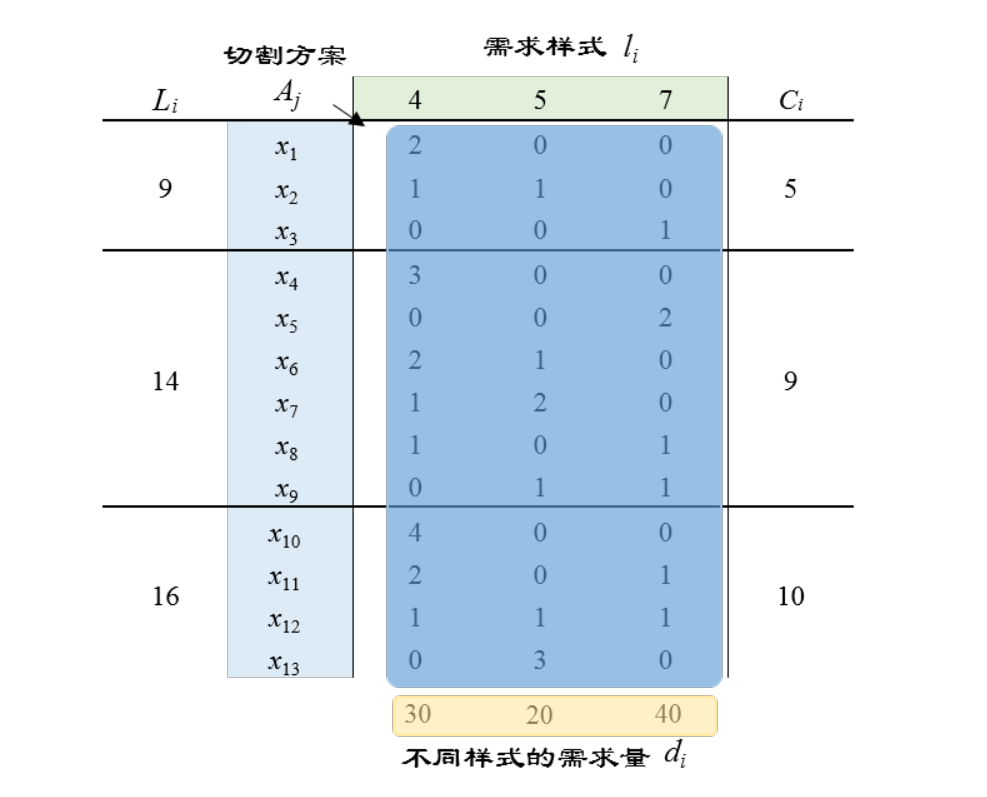
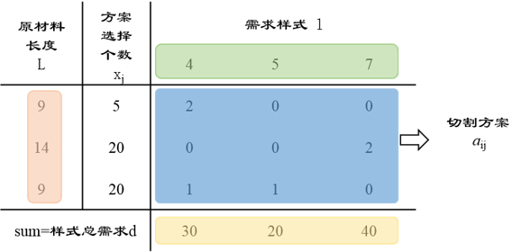

# 第5章 大规模线性规划求解算法

经典的大规模线性规划求解算法有切平面法，列生成和Dantzig-Wolfe分解等，很多算法的应用场景都属于整数规划的范畴。在线性规划专题下，我们简单地给读者介绍列生成和Dantzig-Wolfe分解的原理，想要深入了解的读者可以阅读整数规划专题的相关内容。

## 5.1 列生成算法

作者：阎泳楠，同济大学 交通运输工程 硕士研究生

研究方向：交通网络优化与建模

列生成算法是基于单纯形法的基本思想改进而来的，要理好解列生成，前提条件是掌握好线性规划单纯形法和对偶问题等知识，主要是单纯形法中非基变量进基时检验数（reduced cost）的计算，对偶问题中的影子价格和对偶变量。遗忘了或者对这部分内容不熟悉的读者，可以往前阅读相关章节的内容。

### 5.1.1 引例

下面通过木料切割（Cutting Stock Problem）这一经典问题，介绍列生成算法。

**引例：**木材厂有3种不同长度的木料：9m,14m,和16m。这三种木料的成本价分别是5，9和10元。有顾客需要4m的木料30根，5m的木料20根以及7m的木料40根。如何切割木料，使得既能满足顾客需求，又能使成本最少？

对这样一个小型算例，我们不妨试着枚举一下，这三种长度的木料（9,14,16）一共可以有多少种满足顾客需求（4,5,7）的切割方式。图5.1列出了13种可行的切割方案$A_j$，$A_j$是个三维的列向量，表示每个方案关于三种需求样式的切割次数，每个切割方案的数量用$x_j$表示（注意，此处仅考虑物料浪费最少的切割方案，故并非所有方案）。L表示每种切割方案所用原材料的长度：L=(9,14,16)T，而C对应每种切割方案的成本：C=(5,9,10)T，与原材料长度相关；*l*表示不同的需求样式：*l*=(4,5,7)T；*d*表示不同样式的需求量：*d*=(30,20,40)T。我们举个例子，切割方案 = (2, 0, 0)T表示原材料9m长的木棒，可被切割成2个4m长的木料。

图5.1  满足需求的切割方案

对该物料切割问题建立线性规划模型：

式（5.1）
$$
\min \sum_{i=j}^{13}{c_jx_j}\\
\mbox{s.t.}\quad
\sum_{i=j}^{13}{a_{ij}x_j\geq d_i}\quad i\in \{1,2,3\}\\ 
\ x_j \in Z^{+} \quad j\in\{1,2,...,13\}
$$
式中，$x_j$表示第*j*种方案的数量，取值为正整数；$a_{ij}$表示第j种方案中需求样式i的个数，其中i取值为1，2，3，分别表示4m、5m和7m的需求样式。

我们依然能用单纯形法求解上述模型。先不谈单纯形法求解该模型的效率，仅从需要枚举所有的切割方案$x_j$这一操作，就能知道上述求解方法一定不是最优的。而且上述枚举法存在以下缺点：

-  当原材料长度增加时，切割方案呈指数式增长，我们无法枚举所有的$x_j$；

- 枚举出来的切割方案可能会剩余过多的木料，这种方案通常不会被选择。

单纯形法要求我们列出所有的变量（$x_j$）。回忆一下，单纯形法在每次迭代的过程中，只能用**一个非基变量替换一个基变量**，而最终的**基变量个数仅与约束条件的数量**有关。这么看来，有大部分的$x_j$是不会被用到的（也就是说这些方案都不够好）。因此，我们不需要，也没必要列出所有的$x_j$；再者，对于大规模的问题，我们无法列出满足条件的所有变量。基于此，有学者就提出了求解大规模线性规划的高效算法 —— 列生成法，主要适用于**变量数目（列）大于约束条件个数（行）**的线性规划问题。

### 5.1.2 列生成

列生成算法的主要思想是对那些无法列出所有变量的原问题（master problem，MP），先考虑有限变量的主问题restricted master problem (RMP)，其余变量在有需要的时候，再添加到RMP中。什么变量是需要被加入到RMP中的呢？在单纯形法中，我们根据非基变量检验数的正负来选择进基变量；在列生成中，我们通过子问题（subproblem）来寻找满足reduced cost条件的变量，如果找到的话，就将它加入到RMP中，直至找不到为止，那么MP就求得了最优解。

对5.1.1的引例，我们已经列出了包含13种切割方案的master problem，即式(5.1)。假设初始只考虑3种切割方案(可以与图5.1中列举的方案不一致，如仅考虑9m长原材料的以下三种切割样式$x_1$、$x_2$和 $x_3$,分别取$A_1$=(2,0,0)T、$A_2$=(0,1,0)T和$A_3$=(0,0,1)T，可得到RMP(5.2)。在式(5.2)中，变量的整数约束松弛成了非负约束。

RMP(5.2):
$$
\min {5x_1+5x_2+5x_3}\\
\mbox{s.t.}\quad 
2x_1\geq 30\\
x_2\geq 20\\
x_3\geq 40\\
x_1,x_2,x_3 \geq 0
$$
Subproblem的构建依赖于求解RMP得到的对偶变量，也就是影子价格**w**。获得对偶变量有两种方法：一是通过求RMP的对偶问题获得，二是通过RMP问题中的$C_BB^{-1}$计算得到。基于检验数的计算公式，可以得到Subproblem的目标函数，即
$$
\max \sigma_j = z_j - c_j = C_BB^{-1}A_j-c_j = \sum_{i=1}^{m}{w_ia_{ij}-c_j}\quad i\in\{1,2,3\}
$$

若$max$ ${\sigma_j}>0 $ ，则$A_j$可以加到RMP的约束条件中，变量加$x_j$到目标函数中；若  $max$ ${\sigma_j}\leq0 $，则RMP的当前解已是最优解。

Subproblem的约束条件如下:
$$
\mbox{s.t.}\quad 
\sum_{i=1}^{3}{l_ia_{ij}}\leq{L_i}\\
a_i \geq 0 \quad \ x_j \in Z^{+}
$$
不难理解，影子价格**w**指的是满足顾客需求可获得的价值，那么子问题目标函数的含义可以理解为新切割方案带来的利润，所以只要使利润大于0的切割方案才能被加到RMP中。子问题的个数一般取决于原材料的类型，求解一个子问题能够得到一个切割方案$A_j$。约束条件表示当前切割方案要足原材料的要求。Cutting Stock Problem这类问题的subproblem其实是个背包问题，可以用动态规划等方法求解。对车辆路径问题（Vehicle Routing Problem, VRP）而言，它的子问题是最短路问题。可见，列生成算法可以将规模庞大的原问题分解成规模较小的RMP以及一个经典的，有成熟求解算法的线性规划子问题。求解这两个问题的难度将远远小于求解原问题的难度。

接下来，我们用列生成算法求解引例。

**Iteration 1**：基于RMP(5-2), 用单纯形法可求得$X^*$ = (15,20,40)T, $Z^*$ = 375，影子价格 **w** = $C_BB^{-1}$ = (2.5,5,5). 设新加入的列为$A_4$ = ($a_{14}$,$a_{24}$,$a_{34}$ )T，构造Subproblem。本算例中有三种不同长度的原材料L=(9, 14, 16)T，对应三种不同的成本C=(5,9,10)T，因此这里有三个子问题。

Subproblem 1:
$$
\max {2.5a_{14}+5a_{24}+5a_{34}-\textbf{5}}\\
\mbox{s.t.}\quad 
4a_{14}+5a_{24}+7a_{34}\leq \textbf{9}\\
\ a_{ij} \in Z^{+}
$$
Subproblem 2:
$$
\max {2.5a_{14}+5a_{24}+5a_{34}-\textbf{9}}\\
\mbox{s.t.}\quad 
4a_{14}+5a_{24}+7a_{34}\leq \textbf{14}\\
\ a_{ij} \in Z^{+}
$$
Subproblem 3:
$$
\max {2.5a_{14}+5a_{24}+5a_{34}-\textbf{10}}\\
\mbox{s.t.}\quad 
4a_{14}+5a_{24}+7a_{34}\leq \textbf{16}\\
\ a_{ij} \in Z^{+}
$$
求得三个子问题的解如下：

Subproblem 1:  $A_4$ = (1,1,0)T ,  $\sigma_4 = 2.5$.

Subproblem 2:  $A_4$ = (1,2,0)T ,  $\sigma_4 = 3.5$.

Subproblem 3:  $A_4$ = (0,3,0)T ,  $\sigma_4 = 5.$

三个子问题的检验数都大于0，我们取检验数最大的子问题的解 $A_4$ = (0,3,0)T加入RMP(5.2)中。

**Iteration 2**：   式(5-2)加入了新的切割方案$A_4$后，得到新的RMP(5.3)如下：

RMP(5.3):
$$
\min {5x_1+5x_2+5x_3+\textbf{10}x_4}\\
\mbox{s.t.}\quad 
2x_1\geq 30\\
x_2+\textbf{3}x_4\geq 20\\
x_3\geq 40\\
x_1,x_2,x_3,x_4 \geq 0
$$
切割方案$A_4$对应原材料为16m的木棒，切割成本为10元。可求得$X^*$ = (15,0,40,20/3)T, $Z^*$ = 341.7，影子价格 **w** =$C_BB^{-1}$ = (2.5,10/3,5). 设新加入的列为$A_5$ = ($a_{15}$,$a_{25}$,$a_{35}$ )T ,构造Subproblem.

Subproblem:
$$
\max \quad{2.5a_{15}+10/3a_{25}+5a_{35}-c_j}\\
\mbox{s.t.}\quad 
4a_{15}+5a_{25}+7a_{35}\leq L_i\\
\ a_{ij} \in Z^{+}
$$
第二次迭代中同样有三个子问题，其中$c_j\in\{5,9,10\}$,$L_i\in\{9,14,16\}$.

求得三个子问题的解如下：

Subproblem 1:  $A_5$ = (0,0,1)T ,  $\sigma_5 = 0$.

Subproblem 2:  $A_5$ = (0,0,2)T ,  $\sigma_5 = 1.$

Subproblem 3:  $A_5$ = (0,0,3)T ,  $\sigma_5 = 0$.

三个检验数中只有Subproblem 2的检验数大于0，故将 $A_5$ = (0,0,2)T加入到新的RMP中。

**Iteration 3**：   式(5.3)加入了新的切割方案$A_5$后，得到RMP(5.4)如下：

RMP(5.4):
$$
\min {5x_1+5x_2+5x_3+10x_4+\textbf{9}x_5}\\
\mbox{s.t.}\quad  
 2x_1\geq 30\\
x_2+3x_4\geq 20\\
x_3+\textbf{2}x_5\geq 40\\
x_1,x_2,x_3,x_4,x_5 \geq 0
$$
切割方案$A_5$对应原材料为14m的木棒，切割成本为9元。可求得$X^*$ = (15,0,0,20/3,20)T, $Z^*$ = 322，影子价格 **w** =$ C_BB^{-1}$ = (2.5,10/3,4.5). 设新加入的列为$A_6$ = ($a_{16}$,$a_{26}$,$a_{36}$ )T，构造Subproblem.

Subproblem:
$$
\max \quad{2.5a_{16}+10/3a_{26}+4.5a_{36}-c_j}\\
\mbox{s.t.}\quad 
4a_{16}+5a_{26}+7a_{36}\leq L_i\\
\ a_{ij} \in Z^{+}
$$
求得三个子问题的解如下：

Subproblem 1:  $A_6$ = (1,1,0)T ,  $\sigma_6 = 5/6.$

Subproblem 2:  $A_6$ = (1,2,0)T ,  $\sigma_6 = 1/6$.

Subproblem 3:  $A_6$ = (0,3,0)T ,  $\sigma_6 = 0$.

三个检验数中Subproblem 1的检验数最大，将该检验数对应的切割方案 $A_6$ = (1,1,0)T加入到新的RMP中。

**Iteration 4**：   式(5.4)加入了新的切割方案$A_6$后，得到新的RMP(5.5)如下：

RMP(5.5):
$$
\min {5x_1+5x_2+5x_3+10x_4+9x_5+\textbf{5}x_6}\\
\mbox{s.t.}\quad  
 2x_1+\textbf{1}x_6\geq 30\\
x_2+3x_4+\textbf{1}x_6\geq 20\\
x_3+2x_5\geq 40\\
x_1,x_2,x_3,x_4,x_5,x_6 \geq 0
$$
切割方案$A_6$对应原材料为9m的木棒，切割成本为5元。可求得$X^*$ = (5,0,0,0,20,20)T, $Z^*$ = 305，影子价格 **w** =$ C_BB^{-1}$ = (2.5, 2.5 ,4.5). 设新加入的列为$A_7$ = ($a_{17}$,$a_{27}$,$a_{37}$ )T，构造Subproblem.

Subproblem:
$$
\max \quad{2.5a_{17}+2.5a_{27}+4.5a_{37}-c_j}\\
\mbox{s.t.}\quad 
4a_{17}+5a_{27}+7a_{37}\leq L_i\\
\ a_{ij} \in Z^{+}
$$
求得三个子问题的解如下：

Subproblem 1:  $A_7$ = (0,0,1)T ,  $\sigma_7 = -0.5$.

Subproblem 2:  $A_7$ = (0,0,2)T ,  $\sigma_7 = 0$.

Subproblem 3:  $A_7$ = (0,0,2)T ,  $\sigma_7 = -1$.

当前子问题的检验数均小于等于0，所以X* = (5,0,0,0,20,20)T是RMP(5.5)的最优解。具体方案如下：方案①：将5根9m长的原材料各切成2个4m,；方案②：将20根14m长的原材料各切成2个7m；方案③：将20根9m长的原材料各切成一个4m和一个5m。

图5.2  切方案

### 5.1.3 延伸

除了经典的Cutting Stock Problem，旅行商问题（Travelling salesman problem, TSP），车辆路径问题（Vehicle Routing Problem, VRP），车间调度问题（scheduling）等都可以用列生成算法求得下界。本算例的计算过程都是手动计算的，如果有读者想要了解关于调用求解器求解列生成的算例，可查询参考文献[1-3]。

## 5.2 Dantzig-Wolfe分解

作者：李崇楠 北京交通大学 交通运输规划与管理 研究生在读

研究方向：运输组织优化

在本部分，我们考虑求解具有**特殊结构**的线性规划问题。特别地，我们考虑具有**方块对角**（Block Angular）的线性规划问题，并使用Dantzig-Wolfe分解方法来解决这样的问题。

### 5.2.1 方块对角线性规划问题的分解

考虑具有如下形式的线性规划问题：
$$
\begin{alignat}{2}
\min\quad & \textbf{c}^T \textbf x\\\\
\mbox{s.t.}\quad
&\textbf A\textbf{x} \le \textbf{b}\\\\
& \textbf{x} \geq 0  &{}& 
\end{alignat}
$$
其中$\textbf A$是一个$m\times n$维度的矩阵，并且假设该矩阵能够写成如下的形式：
$$
\textbf A = 
\begin{bmatrix}
   L_1 & L_2 & \cdots & L_K \\\\
   A_1 &   \\\\
    & A_2 & &\vdots \\\\
    && \ddots \\\\
    &&& A_K
  \end{bmatrix}
$$

其中$L_k$是一个子矩阵，维度为$m_L\times n_k$，$k=1,\cdots,K$，并且$A_k$是一个子矩阵，维度为$m_k\times n_k$，$k=1,\cdots,K$，并且满足：$\sum_{k=1}^K n_k=n$以及$m_L+\sum_{k=1}^Km_k=m$。这样的矩阵$\textbf A$称为**方块对角矩阵**.。

令$\textbf x^k$, $\textbf c^k$和$\textbf b^k$为与$\textbf A$对应的子向量，满足：
$$
\textbf x =
\begin{bmatrix}
   \textbf x^1  \\\\
   \vdots   \\
    \textbf x^K \\\\
  \end{bmatrix}, \quad 
  \textbf c  =  \begin{bmatrix}
   \textbf c^1  \\\\
   \vdots   \\\\
    \textbf c^K \\\\
  \end{bmatrix}, \quad 
   \textbf b  =  \begin{bmatrix}
   \textbf b^1  \\\\
   \vdots   \\\\
    \textbf b^K \\\\
  \end{bmatrix}.
$$
进而，原来的线性规划问题可以写成如下的形式：
$$
\begin{alignat}{2}
\min\quad & (\textbf{c}^1)^T \textbf x^1+(\textbf{c}^2)^T \textbf x^2+\cdots+(\textbf{c}^K)^T \textbf x^K \\\\
\mbox{s.t.}\quad
&{L}_1 \textbf x^1+L_2 \textbf x^2+\cdots+L_K \textbf x^K \leq \textbf b^0\\\\
& A_1 \textbf x^1 \leq \textbf b^1 \\\\
&  A_2 \textbf x^2 \leq \textbf b^2 \\\\
& \vdots   \\\\
& A_K \textbf x^K  \leq \textbf b^K \\\\
& \textbf{x}^1,\textbf{x}^2,\cdots,\textbf{x}^K \geq \textbf 0  &{}& 
\end{alignat}
$$
或者使用求和算符写成更加紧凑的形式：
$$
\begin{alignat}{2}
\min\quad & \sum_{k=1}^K (\textbf{c}^k)^T \textbf x^k \\\\
\mbox{s.t.}\quad
&\sum_{k=1}^K L_k \textbf x^k \leq \textbf b^0\\\\
& A_k \textbf x^k  \leq \textbf b^k, \quad \forall k=1,\cdots,K. \\\\
& \textbf{x}^k \geq \textbf 0, \quad \forall k=1,\cdots,K.  &{}& 
\end{alignat}
$$
约束$\sum_{k=1}^K L_k \textbf x^k \leq \textbf b^0$称为**耦合约束**（coupling constraints）或**链接约束**（linking constraints），这种约束的个数为$\textbf b^0$向量的行数，即之前提到的$m_L$。之所以称为耦合约束，是因为如果没有这些约束，那么原来的线性规划问题就可以等价地分解为$K$个独立的子问题（subproblem），其中第$k$个子问题是：
$$
(SP_k):\left\{ 
\begin{alignat}{2}
\min\quad & (\textbf{c}^k)^T \textbf x^k \\\\
\mbox{s.t.}\quad
& A_k \textbf x^k  \leq \textbf b^k \\\\
& \textbf{x}^k \geq \textbf 0  &{}& 
\end{alignat}
\right.
$$
​	这个子问题也是一个线性规划（linear programming）。

​	分解的基本思想是寻找像刚才提到的这种具有方块对角形式的线性规划问题，这时整个问题并不必须一次性全部解决，而是可以分解为若干更小更好解决的子问题。**原问题经过Dantzig-Wolfe分解后，会生成一个只带有耦合约束的主问题（master problem）与若干子问题**。

​	主问题可以写成如下形式：（**注意没有非负约束！**）
$$
(MP):\left\{ 
\begin{alignat}{2}
\min\quad & \sum_{k=1}^K (\textbf{c}^k)^T \textbf x^k \\\\
\mbox{s.t.}\quad
& \sum_{k=1}^K L_k \textbf x^k \leq \textbf b^0 \\\\
\end{alignat}
\right.
$$

### 5.2.2 主问题再塑造

​	仅仅将问题分解为如上介绍的形式是不够的。为了使得分解后的求解更加高效，主问题需要进行再塑造（reformulation）。再塑造可以保证主问题与子问题在求解的过程中交换信息，同时保证分别对每个问题进行求解。但是在重塑后的主问题中，**约束矩阵的列数会远大于行数**，增加求解的难度。以下内容是主问题再塑造的详细过程，对推导不感兴趣的读者可以略过本节，不影响后续阅读。

​	再塑造的关键是如下事实：子问题都是线性规划问题，因此每个子问题的可行域都是多边形（polyhedron）。而在单纯形算法学习中，我们学习过**多边形的表示定理**（Resolution Theorem）：可行域内任意一点可以表示为极点的凸组合和极方向的非负组合，用符号表示该定理为：

​	设$\textbf x^1,\textbf x^2,\cdots,\textbf x^N$为某一线性规划可行域的极点（extreme point），$\textbf d^1,\textbf d^2,\cdots,\textbf d^M$为可行域的极方向（extreme direction）,那么可行域内的任意一点$\textbf x$可以用下式表示：
$$
\textbf x = \sum_{i=1}^N \lambda_i\textbf x^i + \sum_{j=1}^M \mu_j\textbf d^j
$$
​	其中$\lambda_i\in[0,1],\forall i=1,\cdots,N.$ $\sum_{i=1}^N \lambda_i =1$且$\mu_j \geq 0, \forall j=1,\cdots,M$. 令$P_k=\{\textbf x^k | A_k \textbf x^k  \leq \textbf b^k , \textbf x^k \geq \textbf 0 \}$为第$k$个子问题$(SP_k)$ 的可行域. 令$\textbf v^k_1,\textbf v^k_2,\cdots,\textbf v^k_{N_k}$为$P_k$的极点，$\textbf d^k_1,\textbf d^k_2,\cdots,\textbf d^k_{l_k}$为$P_k$的极方向。根据表示定理，$P_k$中的任意一点$\textbf x^k$可以表示为
$$
\textbf x^k = \sum_{i=1}^{N_k} \lambda_i^k\textbf v^k_i + \sum_{j=1}^{l_k} \mu_j^k\textbf d^k_j
$$
​	其中，$\sum_{i=1}^{N_k}\lambda_i^k=1$, 且对于$\forall i=1,\cdots,N_k$, $\lambda_i^k \geq 0$, 对于$\forall j=1,\cdots,l_k,\mu_j^k\geq 0$。将$\textbf x^k$由表示定理得到的展开式代入主问题便得到：
$$
(MP):\left\{ 
\begin{alignat}{2}
\min\quad & \sum_{k=1}^K (\textbf{c}^k)^T (\sum_{i=1}^{N_k} \lambda_i^k\textbf v^k_i + \sum_{j=1}^{l_k} \mu_j^k\textbf d^k_j) \\\\
\mbox{s.t.}\quad
& \sum_{k=1}^K L_k (\sum_{i=1}^{N_k} \lambda_i^k\textbf v^k_i + \sum_{j=1}^{l_k} \mu_j^k\textbf d^k_j) \leq \textbf b^0 \\\\
& \sum_{i=1}^{N_k}\lambda_i^k=1, \quad  k=1,\cdots,K. \\\\
& \lambda_i^k \geq 0, \quad  i=1,\cdots,N_k,  k=1,\cdots,K.\\\\
& \mu_j^k \geq 0, \quad  j=1,\cdots,l_k,  k=1,\cdots,K.
\end{alignat}
\right.
$$
​	将括号打开，得到：
$$
(MP):\left\{ 
\begin{alignat}{2}
\min\quad & \sum_{k=1}^K \sum_{i=1}^{N_k} \lambda_i^k (\textbf{c}^k)^T ( \textbf v^k_i ) + \sum_{k=1}^K \sum_{j=1}^{l_k} \mu_j^k (\textbf{c}^k)^T ( \textbf d^k_j) \\\\
\mbox{s.t.}\quad
& \sum_{k=1}^K \sum_{i=1}^{N_k} \lambda_i^k (L_k \textbf v^k_i)+\sum_{k=1}^K \sum_{j=1}^{l_k} \mu_j^k (L_k \textbf d^k_j) \leq \textbf b^0 \\\\
& \sum_{i=1}^{N_k}\lambda_i^k=1, \quad  k=1,\cdots,K. \\\\
& \lambda_i^k \geq 0, \quad  i=1,\cdots,N_k,  k=1,\cdots,K.\\\\
& \mu_j^k \geq 0, \quad  j=1,\cdots,l_k,  k=1,\cdots,K.
\end{alignat}
\right.
$$
​	这里我们认为极点$\textbf v^k_i$和极方向$\textbf d^k_j$是已知信息，需要求解出最优的系数$\lambda^k_i$与$\mu^k_j$。再由表示定理推算出最优解$\textbf x^*$。换句话说，此时原问题的决策变量是$\lambda^k_i$与$\mu^k_j$。

​	对于每一个极点$\textbf v^k_i\in P_k$，令$f^k_i=(\textbf{c}^k)^T ( \textbf v^k_i )$和$q^k_i=L_k \textbf v^k_i$，对于每一个极方向$\textbf d^k_j$，令$f^{-k}_j=(\textbf{c}^k)^T ( \textbf d^k_j)$和$q^{-k}_j=L_k \textbf d^k_j$。

​	代入主问题得到：
$$
(MP):\left\{ 
\begin{alignat}{2}
\min\quad & \sum_{k=1}^K \sum_{i=1}^{N_k} \lambda_i^k f^k_i + \sum_{k=1}^K \sum_{j=1}^{l_k} \mu_j^k f^{-k}_j \\\\
\mbox{s.t.}\quad
& \sum_{k=1}^K \sum_{i=1}^{N_k} \lambda_i^k q^k_i+\sum_{k=1}^K \sum_{j=1}^{l_k} \mu_j^k q^{-k}_j \leq \textbf b^0 \\\\
& \sum_{i=1}^{N_k}\lambda_i^k=1, \quad  k=1,\cdots,K. \\\\
& \lambda_i^k \geq 0, \quad  i=1,\cdots,N_k,  k=1,\cdots,K.\\\\
& \mu_j^k \geq 0, \quad  j=1,\cdots,l_k,  k=1,\cdots,K.
\end{alignat}
\right.
$$
​	其中约束$\sum_{i=1}^{N_k}\lambda_i^k=1, \quad  k=1,\cdots,K$称为对应于子问题$(SP_k)$的**凸约束**（convexity constraint）。

​	主问题可以进一步紧凑表示：
$$
(MP):\left\{ 
\begin{alignat}{2}
\min\quad & \textbf f^T_v \boldsymbol \lambda + \textbf f^T_d \boldsymbol \mu \\\\
\mbox{s.t.}\quad
& \textbf Q_v \boldsymbol \lambda + \textbf Q_d \boldsymbol \mu  + \textbf s = \textbf r \\\\
& \boldsymbol{\lambda} \geq \textbf 0, \boldsymbol \mu \geq \textbf 0, \textbf s \geq \textbf 0 \\\\
\end{alignat}
\right.
$$
​	其中
$$
\boldsymbol \lambda = (\lambda_1^1,\cdots,\lambda^1_{N_1},\lambda^2_1,\cdots,\lambda^2_{N_2},\cdots,\lambda^K_1,\cdots,\lambda^K_{N_K})^T
$$

$$
\boldsymbol \mu = (\mu_1^1,\cdots,\mu^1_{l_1},\mu^2_1,\cdots,\mu^2_{l_2},\cdots,\mu^K_1,\cdots,\mu^K_{l_K})^T
$$

$$
\boldsymbol f_v = (f_1^1,\cdots,f^1_{N_1},f^2_1,\cdots,f^2_{N_2},\cdots,f^K_1,\cdots,f^K_{N_K})^T
$$

$$
\boldsymbol f_d = (f_1^{-1},\cdots,f^{-1}_{l_1},f^{-2}_1,\cdots,f^{-2}_{l_2},\cdots,f^{-K}_1,\cdots,f^{-K}_{l_K})^T
$$

$$
\textbf r^T = [(\textbf b_0)^T,\textbf e^T] = [(\textbf b_0)^T,\underbrace{(1,\cdots,1)^T}_{K}]
$$

$$
\textbf s^T = [\underbrace{(\textbf s^0)^T}_{m_L},\underbrace{(0,\cdots,0)^T}_{K}]
$$

$\textbf Q_v$是一个矩阵，它对应于$\lambda_i^k$的列为：
$$
\begin{bmatrix} \textbf q^k_i  \\ \textbf e_k  \end{bmatrix} =
\begin{bmatrix} L_k \textbf v^k_i  \\ \textbf e_k  \end{bmatrix}
$$
$\textbf e_k$为单位向量，在第$k$处分量为 1。$\textbf Q_d$是一个矩阵，它对应于$\mu^k_j$的列为：
$$
\begin{bmatrix} \textbf q^{-k}_j  \\ \textbf 0  \end{bmatrix} =
\begin{bmatrix} L_k \textbf d^k_j  \\ \textbf 0  \end{bmatrix}
$$
​	由于子问题的可行域可以有大量的极点和极方向，即使是中等规模的问题，主问题决策变量$\lambda^k_i$与$\mu_j^k$的数目可能也是海量的。换句话说，在重塑后的主问题中，约束矩阵的列数会远大于行数。

### 5.2.3 限制主问题和修正单纯形法

​	针对上述重塑主问题带来的决策变量数量及其多这一难点，下面将介绍**修正单纯形法**（revised simplex method）求解主问题。修正单纯形法的好处是求解过程中大量的决策变量会置零（亦即**非基变量**），这就使得没有必要去生成整个**重塑主问题**。

​	基于上述分析，启发我们去建立一个更小版本的主问题，称为**限制主问题**（restricted master problem），只有一小部分对应于当前基本可行解的$\lambda^k_i$与$\mu_j^k$会在此问题中，其他决策变量是非基的，取值为零。如果在当前基本可行解下，非基变量的**检验数**（reduced cost）都是非负的，那么修正单纯形法终止，得到最优解，否则会有某个检验数为负数的非基变量进基。

​	假设当前限制主问题的基为$\textbf B$，令$\boldsymbol \pi^T=\textbf f^T_B \textbf B^{-1}$，其中$\textbf f_B$由与基变量$\lambda^k_i$、$\mu_j^k$对应的$f^k_i$、$f^{-k}_j$组成.假定$\boldsymbol\pi$的元素为如下形式：
$$
\boldsymbol\pi =
\begin{bmatrix} \boldsymbol\pi^1  \\\\
\pi^2_1 \\\\
\pi^2_2 \\\\
\vdots \\\\
\pi^2_K
\end{bmatrix}
$$
​	其中$\boldsymbol\pi^1$是对应耦合约束的对偶变量，$\pi^2_i$是在限制主问题中对应于子问题$SP_i$的凸约束的对偶变量，进而，非基变量$\lambda^k_i$的检验数为
$$
r^k_i=f^k_i-\boldsymbol \pi^T \begin{bmatrix} \boldsymbol q_i^k  \\\\
\textbf e_k \\ \end{bmatrix} = 
(\textbf c^k)^T(\textbf v^k_i) - (\boldsymbol \pi^1)^T L_k \boldsymbol v^k_i - \pi^k_2
$$
​	非基变量$\mu^k_j$的检验数为
$$
r^{-k}_j = f^{-k}_j - \boldsymbol \pi^T
 \begin{bmatrix} \boldsymbol q_j^{-k}  \\\\ 
\textbf 0 \\ \end{bmatrix} = 
(\textbf c^k)^T(\textbf d^k_j) - (\boldsymbol \pi^1)^T L_k \boldsymbol d^k_j
$$
​	这里会有大量的非基变量，但是没有必要计算所有的检验数.事实上，计算检验数中最小的就足够了。令
$$
r_{\text{min}}= \min_{k=1,\cdots,K} \left \{  
\min_{i=1,\cdots,N_k} \{ r^k_i \}
\right \}
$$
或
$$
r_{\text{min}}= \min_{k=1,\cdots,K} \left \{  
\min_{i=1,\cdots,N_k} \{ (\textbf c^k)^T(\textbf v^k_i) - (\boldsymbol \pi^1)^T L_k \textbf v^k_i - \pi^k_2 \}
\right \}
$$
​	我们进一步令 $r^k_{*}=\min_{i=1,\cdots,N_k} \{ r^k_i \}$，然后让$r^k_{*}$作为子问题$SP_k$的目标函数： 
$$
(SP_k):\left\{ 
\begin{alignat}{2}
\min\quad & \sigma_k=\left ((\textbf c^k)^T - (\boldsymbol \pi^1)^T L_k  \right ) \textbf x^k \\\\
\mbox{s.t.}\quad
& A_k \textbf x^k  \leq \textbf b^k \\\\
& \textbf{x}^k \geq \textbf 0  &{}& 
\end{alignat}
\right.
$$
​	注意到目标函数没有项$-\pi^2_k$，这是因为在固定$k$的情况下，$-\pi^2_k$这一项是固定的。

​	假定使用修正单纯形法去求解子问题，所以如果子问题是**有界的**（bounded），那么生成一个最优解$\textbf x^k$，且它为可行域其中一个极点$\textbf v^k_i$。我们使用符号$i^*\in \{ 1,\cdots,N_k \}$来代表最优极点的标号，那么最优极点为$\textbf v^k_{i^*}$。另外，使用$\sigma^*_k$表示子问题$SP_k$的最优目标函数值，进而有$r^k_*=\sigma^*_k-\pi^k_2$。

​	下面讨论一下子问题在求解过程中可能出现的三种情况： 

​	(1)如果所有子问题都是有界的，并且 $r_{\text{min}}<0$，令$t$是$r^k_*$取得最小的标号，即$r_{\text{min}}=r^t_*$。对应于子问题$SP_t$的最优极点$\textbf v^t_{i^*}$的列
$$
\begin{bmatrix} \boldsymbol q_i^t  \\\\
\textbf e_t \\ \end{bmatrix} =
\begin{bmatrix} L_t \boldsymbol v_{i^*}^t  \\\\
\textbf e_t \\ \end{bmatrix}
$$
将会进入基$\textbf B$(basis)。

​	(2)如果所有子问题都是有界的，并且$r_{\text{min}}\geq0$，那么当前的基为最优的基。

​	(3)如果这里有至少一个子问题是**无界的**（unbounded），令$s$是子问题无界的标号，即子问题$SP_s$无界.此时修正单纯形法对应于子问题$SP_s$会返回一个满足$((\textbf c^s)^T-(\boldsymbol \pi^1)^T L_s)\textbf d^s_{j^*}<0$的极方向$\textbf d^s_{j^*}$，其中 $j^*\in \{1,\cdots,l_s\}$，并且对应于$\mu^s_{j^*}$的列   
$$
\begin{bmatrix} \boldsymbol q_{j^*}^{-s}  \\\\ 
\textbf 0 \\ \end{bmatrix} =
\begin{bmatrix} L_s\boldsymbol d_{j^*}^{s}  \\\\
\textbf 0 \\ \end{bmatrix}
$$

将会进入基$\textbf B$(basis)。

### 5.2.4 Dantzig-Wolfe分解方法的步骤

**算法步骤**

​	在经过前面的介绍之后，我们可以正式介绍Dantzig-Wolfe分解方法的步骤。

​	**Step 0**：**初始化**。生成主问题的一个初始基$\textbf B$。令$\textbf x_B$为基变量向量，$\boldsymbol{\bar B}$为基变量的指标集合（index set），并让所有非基变量为0，得到限制主问题。

​	**Step 1**：**得到单纯形算子**。通过解线性系统：$\textbf B^T \boldsymbol pi = \textbf f_B$来得到单纯形算子$\boldsymbol \pi$。

​	**Step 2**：**最优性检验**。对于每一个$k=1,\cdots,K$，使用修正单纯形法求解子问题$SP_k$，亦即求解：
$$
(SP_k):\left\{ 
\begin{alignat}{2}
\min\quad & \sigma_k=\left ((\textbf c^k)^T - (\boldsymbol \pi^1)^T L_k  \right ) \textbf x^k \\\\
\mbox{s.t.}\quad
& A_k \textbf x^k  \leq \textbf b^k \\\\
& \textbf{x}^k \geq \textbf 0  &{}& 
\end{alignat}
\right.
$$
​	如果 $SP_k$是无界的，那么进入Step 3；否则，令$\textbf x^k=\textbf v^k_{i^*}$来代表最优的基本可行解，并去计算检验数$r^k_*=\sigma^*_k-\pi^2_k$。如果所有的$k=1,\cdots,K$都已经完成上面的工作后，考虑$r_{\text{min}}$的情况：

​	若 $r_{\text{min}}\geq 0$，那么终止算法，当前的基为最优的基，否则进入Step 3。

​	**Step 3**：列生成。如果所有子问题$SP_k$都是有界的，并且$r_{\text{min}} < 0$，那么令$t$为指标，该指标满足：$r_{\text{min}} = r^t_{*}$。令
$$
\boldsymbol {\bar a} =
\begin{bmatrix} \boldsymbol q_{i^*}^t  \\\\ 
\textbf e_t \\ \end{bmatrix} =
\begin{bmatrix} L_t \boldsymbol v_{i^*}^t  \\\\ 
\textbf e_t \\ \end{bmatrix}
$$
其中$\textbf v^t_{i^*}$是子问题$SP_t$的最优极点，并进入Step 4。

否则存在一个子问题$SP_s$是无界的，那么会有极方向$\textbf d^s_{j^*}$生成，该极方向满足$((\textbf c^s)^T-(\boldsymbol \pi^1)^T L_s)\textbf d^s_{j^*}<0$，并且令
$$
\boldsymbol {\bar a}
=
\begin{bmatrix} \boldsymbol q_{j^*}^{-s}  \\\\ 
\textbf 0 \\ \end{bmatrix} =
\begin{bmatrix} L_s\boldsymbol d_{j^*}^{s}  \\\\ 
\textbf 0 \\ \end{bmatrix}
$$
进入Step 4。

​	**Step 4**：**生成下降方向**。令下降方向为$\textbf d$，求解线性系统$\textbf B\textbf d = -\boldsymbol {\bar a}$得到$\textbf d$。如果$\textbf d \geq \textbf 0$，那么原问题是无界的，**终止**算法，否则进入Step 5。

​	**Step 5**：**生成步长**。利用
$$
\alpha = 
\min_{l\in \boldsymbol{\bar B}} \{ 
-\frac{x_l}{d_l} | d_l < 0
\}
$$
 计算步长（最小比率检验 minimum ratio test），令$l^*$为指标满足   
$$
\alpha = - \frac{x_{l^*}}{d_{l^*}}
$$
进入Step 6。

​	**Step 6**：**更新基本解**。$\textbf x_B := \textbf x_B + \alpha \textbf d$来更新基本解，进入Step 7。

​	**Step 7**：**更新基**。令$\textbf B_{l^*}$为对应于出基变量$x_{l^*}$位于基$\textbf B$的列。通过$\textbf B_{l^*}$离开基，并在对应位置添加$\boldsymbol {\bar a}$的方式来更新基。回到Step 1。

**参考代码下载**

作者利用MATLAB完成了Dantzig – Wolfe分解的代码，代码下载地址为：

链接: https://pan.baidu.com/s/1NDnLFnMq4MjRUqAfNPIKiQ 

密码: l2tz

### 参考文献

[1]  [【学界/编码】从下料问题看整数规划中的列生成方法_附Gurobi求解器源代码](https://zhuanlan.zhihu.com/p/32718222 )

[2] [干货 | 10分钟带你彻底了解column generation（列生成）算法的原理附java代码](https://www.jianshu.com/p/efb59a5d1b13 )

[3]  [开源的Julia实例给出了column generation求解Cutting Stock Problem的详细步骤](https://www.juliaopt.org/notebooks/Chiwei%20Yan%20-%20Cutting%20Stock.html)

