# 第六章 网络流问题

作者：阎泳楠，同济大学 交通运输工程 硕士研究生

研究方向：交通网络优化与建模

网络流问题是一类特殊的线性规划问题，如前面章节讨论的运输问题，除了可以写成线性规划的形式，还能将该问题构建成网络的形式求解。我们的生活中有各种各样的网络，如道路网，电网，通信网等等。网络的应用也十分广泛，如物资的配送，线网的铺设，站点的选址，工程进度的安排等。本章将介绍基本的网络流概念以及四种重要的网络流问题：最短路径问题、最小生成树问题、最大流问题和最小费用流问题。

## 6.1 图论

网络流问题通常用图来表示。在本小节，我们主要介绍以下两个方面的内容：

（1）图论中的基本概念，定义本章节中出现的记号；

（2）介绍表征网络常用的数据结构。

前方预警，下文将涉及描述网络时不得不提到的术语，编者已尽力用最通俗易懂的语言去解释了。建议读者在阅读本节时可对照图示理解，有个印象即可，后续内容碰到了再来回顾相关概念。

### 6.1.1 图的基本概念

- **无向图和有向图**

  网络，其实也就是一张图，由不同的节点和节点之间的连线（弧）组成。根据弧是否有方向，可分为有向弧和无向弧。若图中所有的弧都是无向弧（有向弧），则称为无向图*G*=(*N*, *E*)（有向图*G*=(*N*, *A*)）。*N*表示图中节点的集合，*E*表示无向弧，*A*表示有向弧。图6.1所示的两个网络都有五个节点，其中左图是无向图，有7条弧；右图是有向图，有8条弧。图论中的一些术语会因无向图和有向图而有所不同，下面将分别进行介绍。

  |  |  |
  | :----------------: | :------------------: |
  |       无向图       |        有向图        |

  
图6.1 无向图和有向图

  

  **链和圈**

  在无向图中，如果两个节点不能直接相连，需要通过其它节点和弧连接，则称这两个节点之间的序列为一条链。如果一条链中没有重复的边，则为**简单链**；如果既无重复的边又无重复点，则称为**初等链**。始点与终点相同的链，称为**圈**。图6.2给出了图6.1中无向图中的一条简单链，初等链和圈。

  |  |  |  |
  | :------------------: | :------------------: | :------------------: |
  |        简单链        |        初等链        |          圈          |

  
图6.2 简单链、初等链和圈

- **路和回路**

  在有向图中，与链和圈相对应的概念是路和回路。路与链一样都是点序列，不同的是路具有方向性。同样地，一条路的起点与终点重合，则称为一条**回路**。如果路或回路上没有重复的点，则称它们为**初等路**和**初等回路**。图6.1中有向图的一条路，初等路如图6.3所示，该有向图不存在回路。

  |  |  |
  | :------------------: | :------------------: |
  |   路：1-2-4-5-3-2    |  初等路：1-3-2-4-5   |

  
图6.3 路和初等路

- **连通图**

  在一个图中，如果任何两个节点之间，至少有一条链或路，则称该图为**连通图**，否则称为非连通图。如图6.1是连通图，图6.4为非连通图。

  

  
图6.4 连通图

- **树和生成树**

  树是图论中最重要的概念之一。**一棵树必然是无圈且连通的**。一棵有m个节点的树，共有m-1条边。事实上，从树上每去掉一个节点，同时也一定会去掉一条边，最后当该树只剩下两个顶点时，也就只剩下一条边了（树的无圈连通性）。所以，树中边的数目比节点数目少1。反过来说，一个有m个节点m-1条边的**连通图**必是一棵树。

  **生成树指的是包含图中所有节点的连通的树**。“生成”一棵“树”只需要删除原网络中的所有边，再按一定规则依次添加上边，避免添加边后形成环。添加m-1条边后，恰好连接m个节点，此时得到生成树。图6.5中红色的边与节点连成的链即为原网络的一棵生成树。我们在后面的章节中将具体介绍计算一个网络中最小生成树的方法。
  
  | 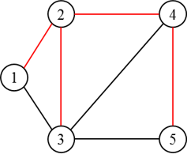 | 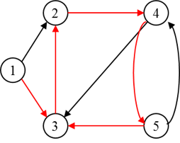 |
  | -------------------------- | -------------------------- |
  | 无向图的生成树             | 有向图的生成树             |

图6.5 生成树

### 6.1.2 网络的表示方法

上一节，我们讨论的图仅涉及其拓扑结构，即节点与弧之间的连接关系，但这些并不足够，因为实际的网络问题仍需要对弧加以定量的描述。例如在交通网络图中，除了要描述各城市之间是否存在公路、铁路等运输线外，仍需要表达这些线路的长度、通行能力、运输成本等，这些数值统称为**权**。

为了方便在计算机上进行存储与计算，我们一般用矩阵表示一个网络。下面以有向图为例，介绍两种矩阵表示网络的方法。

- **节点-弧关联矩阵**（Node-Arc Incidence Matrix）

  节点-弧关联矩阵也可简称为关联矩阵，用来表示节点（$n_i$）和弧（$a_j$）的关联状态。每一行表示一个节点，每一列表示一条弧。关联矩阵中元素$S_{ij}$的定义如下：

  
  $$
  S_{ij} = \begin{cases}\text1,\quad弧a_j自节点n_i射出\\-1,\quad弧a_j自节点n_i射入\\0, \quad 弧a_j与节点n_i不关联\end{cases}
  $$
  以图6.1中的有向网络为例，我们来写它的关联矩阵（见图6.6）。该有向图有5个节点，8条边，所以关联矩阵是个$5\times8$的矩阵。以弧$a_1$为例，该弧自节点1射出，节点2射入，所以$s_{11}$=1, $s_{21}$=-1。仔细观察，我们可以得到关联矩阵的以下特征：(1) 关联矩阵是个稀疏阵，在 $m\times n$个元素中，只有2m个非零元素，因此关联矩阵不具有空间效率。(2) 每列都有两个非零元素，一个取值+1，一个取值-1，这反映了每条弧的两个端点及指向。

  

  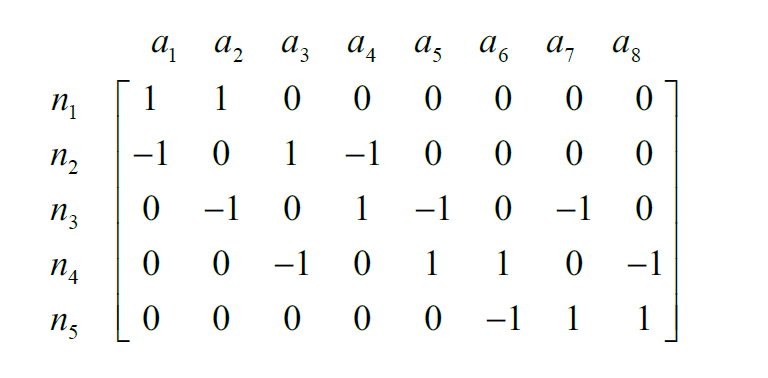

  
图6.6 关联矩阵示意图

- **节点-节点邻接矩阵**（Node-Node Adjacency Matrix）

  节点-节点邻接矩阵，也可简称为邻接矩阵，表示各节点之间的连通状态。该矩阵每一行，每一列都对应一个节点。邻接矩阵元素$h_{ij}$的定义如下：
  
  
  
  
  $$
  h_{ij} = \begin{cases}\text1,\quad 存在自节点n_i射向n_j的弧\\0, \quad 存在自节点n_i射向n_j的弧\end{cases}
  $$
  图6.1中有向网络的邻接矩阵如下：

  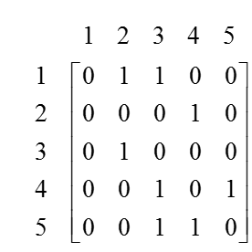
  
  不难发现，邻接矩阵是$n\times n$个的方阵，含有*m*个非零元素。如果网络足够密集，邻接矩阵在空间上是高效的，因而常被用于网络算法中。此外，邻接矩阵也可用于存储路段费用和路段通行能力。
  
  有了上述表征网络的方法，我们可以方便用计算机对网络流问题进行建模和求解。接下来，将介绍四种主要的网络流问题。

## 6.2 网络流问题建模

本节将介绍四大经典网络流模型：

- 最短路径问题 (shortest path problem)
- 最小生成树问题 (minimum spanning tree problems)
- 最大流问题 (maximum flow problem)
- 最小费用流问题 (minimum cost network flow problem)。

最小费用流是最一般的网络流问题，最短路径问题和最大流问题都是它的特殊形式。

### 6.2.1 最短路问题

最短路径问题是网络流模型中的一个最基本的问题。在生产实践，运输管理中，诸如工艺路线安排，管道线网铺设、设备更新等问题都可建模为最短路问题。

#### 问题描述

下面看一个简单的例子。在1号小区有一个快递网点，快递小哥需要给位于8号小区的顾客派件，途中可能会经过若干个小区。为提高配送效率，快递小哥需要选择一条**最快的路径**到达8号小区。我们可以将上述问题抽象成如图6.7所示的网络图，弧上的权值表示小区间的距离，这种弧上有权值的图称为赋权图。该问题可以基于图论的方法在网络上求解。

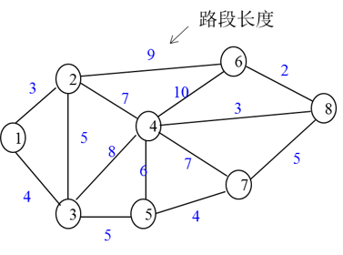

图6.7 快递配送示例网络

#### 问题求解

在该例子中，我们要帮快递小哥找到1号小区到8号小区的最短路径，但是从1号小区无法直接到达8号小区，途中必须经过其它小区。其实，从1到8的最短路径，必定也是1号小区到该路径上某个中间节点的最短路径。

我们通过反证法来证明。在图6.8中，如果P是$v_s$到$v_j$的最短路径，而$v_i$是P中的一个点，那么在P上$v_s$到$v_i$的路径也是最短路径。如果Q是$v_s$到$v_i$的最短路径，P’是$v_s$沿着Q到$v_i$再沿P到$v_j$的路径，那么P’的权肯定小于P，这与P是最短路径相矛盾了。这证明了最短路径问题的**最优性原理**：**最短路径的子路一定是最短路径**。

根据最优性原理，找$v_s$到$v_j$的最短路径可以通过找$v_s$到$v_i$的最短路得到，而$v_s$到$v_i$的最短路又可以通过找其最短子路得到，由此不断地向前追踪，直至回到起点。由此看来，我们通过找$v_s$到$v_j$中间节点的最短路径，从而找到由起点$v_s$到终点$v_j$的最短路径。

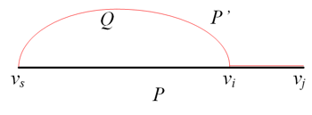

图6.8 最优性原理证明

**Dijkstra**算法就是根据这样一个思路来进行求解最短路径的。它是一个标号算法，将所有顶点分为两类，一类是有永久标号的顶点，另一类是临时标号节点。具体操作如下：

**1.** **初始化**。算法初始化过程将起点标记为永久标号，标签设为0，其余节点为临时标号，标签为∞。

**2.** **迭代过程**。按公式(6.1)更新与永久标号节点相邻节点的临时标号，并将临时标号中标签最小的节点变为永久标号（公式(6.2)）。需要注意，每次迭代有若干个临时标号得到更新，且只有一个编号能变成永久标号。

公式(6.1)
$$
l_{k+1}(v_j) =min\{l_k(v_j),l_k(v^*)+W(v^*,v_j)\}
$$
公式(6.2)
$$
l_{k+1}(v^*) =min_{v_j\in\bar{A}}\{l_{k+1}(v_j)\},\quad\bar{A}=A-\{V^*\}
$$
其中，k表示第k次迭代次数， $l_k(v_j)$表示从起点开始到节点$v_j$的路径长度；初始化中，除起点外，其余节点的 $l_k(v_j)$值都取∞；A表示所有节点的集合，$ \bar{A}$表示临时标号节点的集合，v*表示永久标号节点。

例题. 用Dijkstra算法求解问题描述中的快递配送问题。

**步骤1**：**初始化**。将节点1设为永久标号，设为0，其余节点为临时标号节点，标签为∞。图中红色的数字表示永久标号的标签。

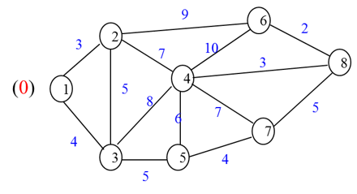

**步骤2**：更新与节点1相邻的节点2和节点3的标签。
$$
l_2(v_2) = min\{∞，0+3\}=3\\
l_2(v_3) = min\{∞，0+4\}=4
$$
临时标号中，节点2的标签最小，将节点2变为永久标号。

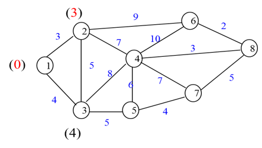

**步骤3**：更新与节点2相邻的节点3、节点4和节点6的标签。
$$
l_3(v_4) = min\{∞，3+7\}=10\\
l_3(v_6) = min\{∞，3+9\}=12\\
l_3(v_3) = min\{4，3+5\}=4
$$
临时标号中，节点3的标签最小，将节点3变为永久标号。

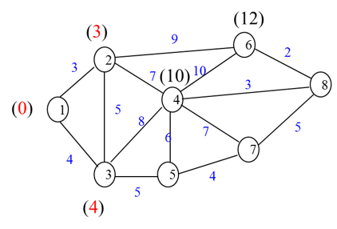

**步骤4**：更新与节点3相邻的节点4和节点5的标签，保留节点6的临时标号。
$$
l_4(v_4) = min\{10，4+8\}=10\\
l_4(v_5) = min\{12，4+5\}=9\\
l_4(v_6) = min\{12，∞\}=12
$$
临时标号中，节点5的标签最小，将节点5变为永久标号。

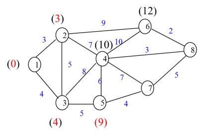

**步骤5**：更新与节点5相邻的节点4和节点7的标签，保留节点6的临时标号。
$$
l_5(v_4) = min\{10，9+6\}=10\\
l_5(v_7) = min\{∞，9+4\}=13\\
l_5(v_6) = min\{12，∞\}=12
$$
临时标号中，节点4的标签最小，将节点4变为永久标号。

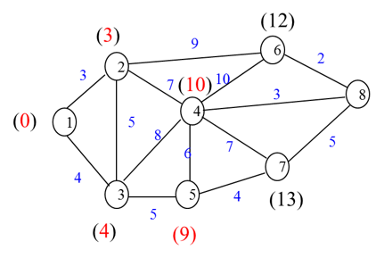

**步骤6**：更新与节点4相邻的节点6,7,8的标签。
$$
l_6(v_6) = min\{12，4+10\}=12\\
l_6(v_7) = min\{13，10+7\}=13\\
l_6(v_8) = min\{∞，10+3\}=13
$$

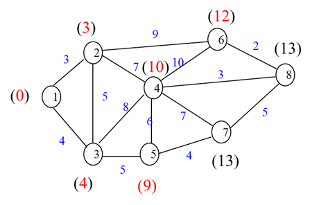

临时标号中，节点6的标签最小，将节点6变为永久标号。

**步骤7**：更新与节点12相邻的节点8的标签，保留节点7的临时标号。
$$
l_7(v_8) = min\{13，12+2\}=13\\
l_7(v_7) = min\{13，∞\}=13
$$

临时标号中，节点7和节点8标签相等，可任意选择其中一个将其变为永久标号。在此将节点8变为永久标号，可得到节点1到节点8的最短路径长度，为13.

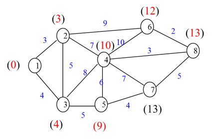

**步骤8**：更新与节点8相邻的节点7的标签。
$$
l_8(v_7)= min\{13，13+5\}=13
$$
当前只剩下最后一个临时标号节点，将其变为永久标号，算法终止。

上述步骤也可以用以下运算表格体现，每一行表示每一次迭代过程，有星号标记的表示该标签已设为永久标号，无需进行标签更新。

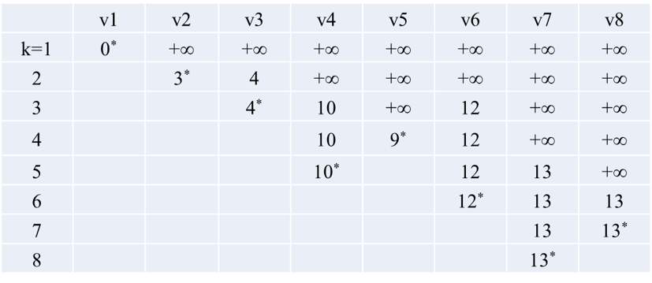

到目前为止，我们找到了从小区1到小区8的最短路径长度为13，但是并不知道这条路径经过了哪些节点。下面，我们介绍用逆向追踪的方法来寻找最短径。从节点8开始，反向追踪找其紧前节点，需满足$l(v_j)=l(v_i)+w_{ij}$,由此得到由节点1到节点8的最短路径为$v_1v_2v_4v_8$.

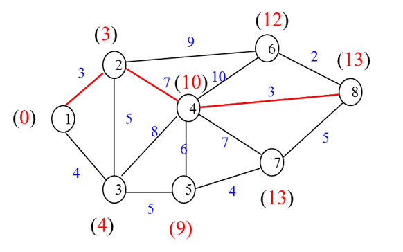

图6.9 示例网络最短路径

#### 模型表达

求解节点1到节点m的最短路径问题不但可以转化成网络图，用专门的图论算法进行求解，还可以写成如下线性规划模型。

$$
Maximize\quad \sum_{i=1}^m\sum_{j=1}^mc_{ij}x_{ij}\\
s.t.\quad \sum_{j=1}^{m}{x_{ij}}-\sum_{k=1}^{m}{x_{ki}}=b_i=\begin{cases}1,\quad if\quad i=1\\0,\quad if\quad i\neq1\quad i\neq m\\-1, \quad if\quad i=m\end{cases}\\
x_{ij}=0\quad or\quad 1\quad i,j\in\{1,...,m\}
$$
决策变量$x_{ij}$表示边(*i*, *j*)是否在最短路径上，是则取1，否则取0. 目标函数表示最小化这条路径上的费用。约束条件是针对节点的流量守恒约束：$\sum_{j=1}^{m}x_{ij}$ 表示节点$i$的流出量，  $\sum_{k=1}^{m}x_{ki}$ 表示节点$i$的流入量。针对节点在网络中的不同位置，如起点、中间节点、终点，$b_i$表示节点$i$的净流量，分别取值为1, 0, -1. 其实，决策变量的0-1约束也可以被非负约束 $x_{ij}\leq 0$代替，因为如果网络中存在最短路径的话，用单纯形法求解时，自然而然就能得到取值为0或1的整数解。此外，将变量设成非负约束还能够将原整数规划问题转换为线性规划问题，求解难度下降。

#### 	其它应用

**路面更新问题**：某新建公路设计年限为20年，使用若干年后，路面需更新（重铺路面）。把设计年限（20年）分成四个时期，每个时期为五年。假设每个时期内，各年的路面养护费及由于路面损坏而引起的附加行驶费用是不变的。又设路面更新是在某个时期的期末进行的，由于各个时期路面的损坏情况不同，故各个时期路面更新费用也不一样。试确定其使用期限20年内的路面更新计划使总费用最小。路面更新问题各期的具体费用见图6.10。 

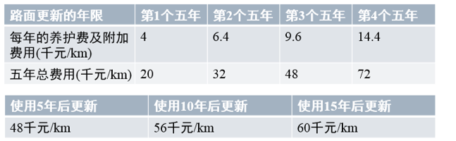

图6.10 路面更新问题描述

路面更新问题其实是求最小花费的路面更新方案，可以构建图网络，转换为最短路问题进行求解，见图6.11。

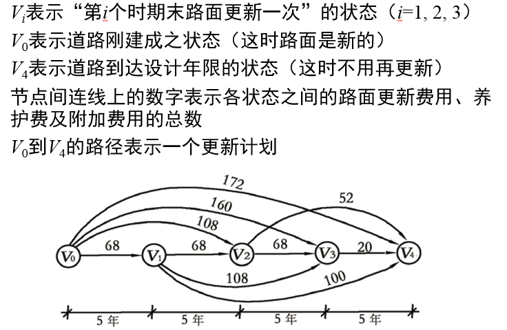

图6.11 路面更新问题网络图

一般而言，有以下几种最短路径问题：（1）在非负赋权图中，找一个节点到所有节点的最短路径；（2）在实数赋权有向图中，找一个节点到所有节点的最短路径；（3）找任意两个节点之间的最短路径。

本节中介绍的Dijkstra仅适用于非负权图的一对多的最短路径的求解。至于负权图，或求解多对多的最短路径问题，可以参考Floyd、A*、Bellman-Ford等算法。这些算法在网上及运筹学教材都能找到相应的资料（[4]-[6]）。

### 6.2.2 最小生成树问题

在图的基本概念这一小节中，我们介绍过生成树的基本概念了。对赋权图而言，它的生成树有n个节点，n-1条边。由于每条边有不同的权重，我们希望找到一棵各边**权值之和最小**的生成树，这样的问题被称最小生成树问题。

同样是考虑各边权值之和最小，那么最小生成树与最短路问题有什么区别呢？

1. 最小生成树能保证连通所有节点的路径之和最小，但不能保证任意两点之间是最短路径。最短路径是从一点出发，到达目的路径的最小值。

2. 一般而言，最小生成树针对无向图，最短路问题针对有向图。针对无向图的最短路问题很容易扩展到有向图上，但是在有向图上求一个给定树根的最小生成树（有向树）比求无向图中的最小生成树复杂得多。

#### 相关应用

- **物理网络设计**

  这类问题主要是设计一个网络，使得各网络的组成成分得以相连；或者是给位于不同地理位置的用户提供基础设施，使他们可以相互沟通。前者如在给某个地区的村庄布设道路，后者如架设一个通往各乡的电话线。这些问题的目标函数都要求建设成本最小，是最小生成树问题的一个典型应用。

- **最小生成树（MST）聚类**

  聚类问题的核心就是将一组数据划分成不同的组，**组内数据点间的距离要远小于组间距离**。图6.12简单介绍了MST聚类的过程。图6.12(a)显示这是一个有27数据点的数据集。图6.12(b)是该数据集的最小生成树。现在要将该数据集分成四类，只需要删除该最小生成树上的三条边。我们在这里选择距离最长的三条边，如图6.12 (c)所示，这样才能保证各簇团内的点距离最小，且小于簇团间的点。

  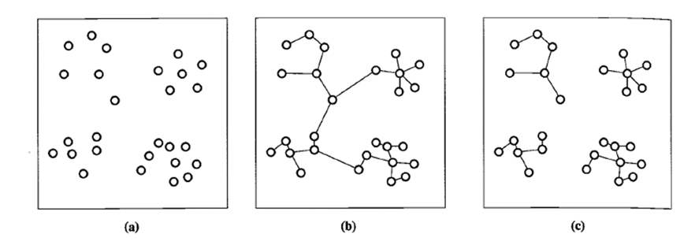

  
图6.12 最小生成树聚类

#### 问题求解

我们通过具体算例来介绍求解最小生成树问题的算法。

图6.13所示的赋权连通无向图G中各顶点表示某个地区的8个乡，边上的权表示乡之间的距离。现欲架设一个通往各乡的电话线网，问应该如何架设电话线网而使其总长度最短？

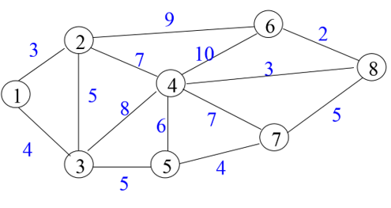

图6.13 最小生成树算例网络

上述问题实际上就是找G中的一颗生成树，使得树各边权和最小。我们分别用**破圈法**和**避圈法**进行求解。

**方法一：破圈法**

**基本思想**：因为无回路且连通是树的特性。为此，我们保证各点之间的连通性，每次在图中任取一个回路，删去权最大的边，直至图中无回路为止。这样剩下的边都是权值最小的，得到的生成树就是最小生成树。

**具体操作**：该算例的求解步骤从权重最大的边（10）开始删除，然后再删除剩余边中权重最大的（9），再依次删除权重为8,7,6,5的边，直到图中不存在回路为止。读者可能感觉到这并不是先选回路再选择权重大的边，也没有体现选择回路时的随机性。不过读者可以自己练习一下，先随机取一个回路，再删除其中权最大的边，得到的结果是一样的。最终求得的最小生成树的权值为3+4+5+4+5+3+2=26。

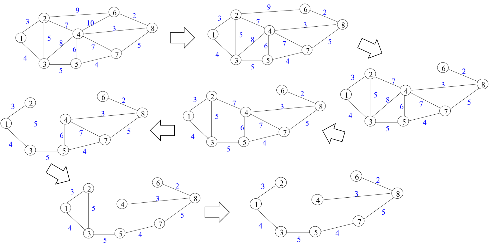

图6.14 破圈法具体步骤

**方法二：避圈法**

**基本思想：**生成树无圈且边数为n-1。该算法根据“在无圈的条件下优先选取权小的边”这一原则，从图的m条边中逐个挑选出n-1条边。注意：新加入的边不能与已挑选的边组成圈。

**具体操作：**

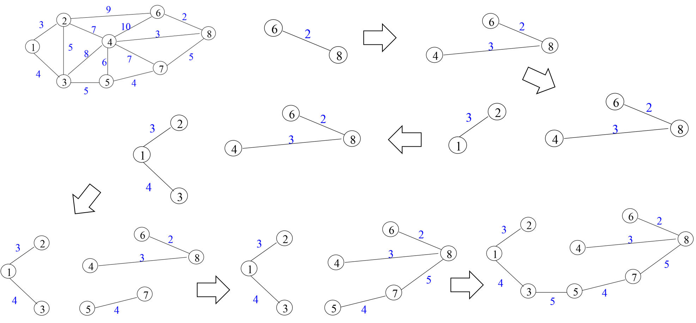

图6.15 避圈法具体步骤

最终求得的最小生成树的权值为3+4+5+4+5+3+2=26。两种方法求得的最小生成树和权值都一样。注意，最小生成树有可能不唯一，但是树的权值一定唯一。

### 6.2.3 最大流问题

在此之前，我们研究的网络流问题都仅涉及网络的节点，边及边上的权值，在本节我们将引入流的概念。**流，网络上承载的实体**。不同的物理网络，承载的流也各不相同。在城市路网中，有可能是小汽车，公交车，自行车等；在通信网络中，流是传递的信息；在电网中，流是传输的电量；在企业的生产网中，流是传送带上的产品。不管这个网络上运送的是什么样的流，都需要考虑这样一个问题：这个网络能承载的最大流量是多少？这就是我们本节要讨论的**最大流问题**。

#### 问题描述

我们讨论运输网络中的最大流问题。在图6.16中，A1和A2处分别有物资12吨和24吨，B1和B2处分别需要物资16吨和20吨， F1、F2和F3为转运点，边上的数字为该运输线路运送该物资所允许的**最大输送量**。如何调运物资，使得A1和A2处有**最多的物资**输送到B1和B2处？

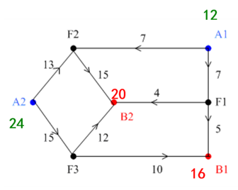

图6.16 运输网络

在图6.16中，存在三种类型的节点：运输流的发点（源）——A1和A2，收点（汇）——B1和B2，中间节点——F1、F2和F3。这个例子中，边上的数字不表示运输成本，仅表示边的**容量。**所以，在这个运输网络中，我们不要考虑运输成本，只需要保证每条边上运输的物资不能超过它能承载的最大容量，并考虑如何将更多的产品从发点运送至收点。

下面我们将介绍最大流问题中的一些概念。

**流**：设*f*(*e*)为边e的流值，$𝑓^+(𝑣)$为以v为起点的所有有向边流出量的和；$𝑓^-(𝑣)$为以v为终点的所有有向边流入量的和。如果*f*(*e*)满足以下两个条件：

- 容量约束条件，即有$0\leq f(e)\leq u(e)$, ∀e∈E  ；

- 中间节点流量守恒，即$𝑓^+(𝑣)$=$𝑓^-(𝑣)$, ∀𝑣∈𝐼 ，中间节点的流出量=流入量；

称*f*为网络上的一个流。 

图6.17 流量守恒约束

**单源单汇运输网络**：在本节中我们讨论的运输网络有且仅有一个源一个汇，称为单源单汇网络。图6.16所示的运输网络是多源多汇网络，我们将图中的节点按源，中间节点，汇的顺序重新排列，将其转换成图6.18所示的单源单汇网络，并给出了一种可能的流值。边上两个参数的含义分别表示边的**容量**和**流值**（$u(e)$，$f(e)$）（后面若无特别说明，都为此含义），整个网络的流Val *f =* $𝑓^+(x)$=$𝑓^-(y)$。当前运输方案下的网络流为35，即从出发点x1输出物资12吨，从出发点x2输出物资24吨。当前的方案是该网络可以承载的最大流吗？这就是本节我们要关注的问题。

 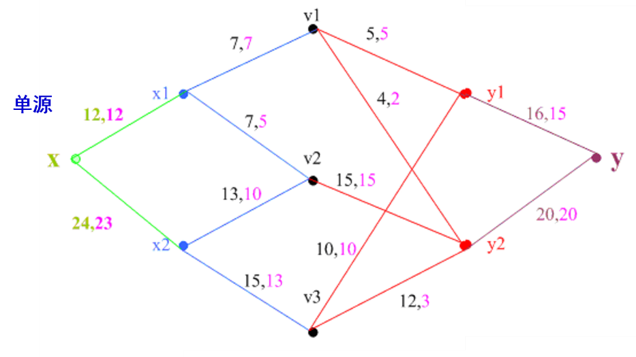

图6.18 单源单汇运输网络

#### 问题求解

本节将介绍标号算法求解最大流问题，在此之前先介绍**增广链**这一概念。

首先，什么是链？**链**面向的是基本图，并**不需要方向**。增广链还是一条**初等链**，即链中不可以有重复的节点，其实这与路径的概念有些相似，只不过路径需要朝着同样的方向前进。所以，路径一定是初等链，但初等链不一定是路径。图6.19给出了一条由x到y的初等链，由于v5-v4, v4-v3的方向与x-y的方向（也就是前进方向）相反，所以这条初等链不是路径。我们将与前进方向相反的有向边称为**后向边**，与前进方向相同的有向边称为**前向边**。

图6.19 一条初等链

对于前向边，我们关注这条边是不是**饱和边**，也就是说前向边上的流量是否等于边的容量。如果不相等，则说明该边非饱和，还可以增加流量直至饱和。对于后向边，我们关心这条边是不是**零流边**，即后向边上的流量是否等于零。对于非零流的后向边，我们希望减少该边上的流量，最好能使流量为0。为什么呢？其实可以这么理解，后向边与链的前进方向相反，也就是“逆行”了，属于“无效”运输，所以我们要尽可能减少后向边的流量，让更多的流量集中在前向边上，保证流量的有效运输。

因此，我们需要找到满足以下条件的初等链：**前向边有非饱和边，后向边中有非零流边**，通过调整链上的流量，可提高流值，这就是刚开始提到的增广链。由此可见，图6.19中的初等链是一条增广链。

具体的调整方法如下：

设Q为一条初等链，*f*是当前网络上的流，对 $e\in Q$，令：

$$
l(e) = \begin{cases}u(e)-f(e)\quad e\in Q,前向边\\f(e)\quad e\in Q,后向边\end{cases}
\\
l(Q)=min\{l(e)|e\in Q\}
$$
$l(Q)$即为该链上的流量调整量，该网络上的新流 $\tilde{f}$可以通过以下方法得到：

$$
\tilde{f} = \begin{cases}f(e)+\delta\quad e\in Q,前向边\\f(e)-\delta\quad e\in Q,后向边\\f(e)\quad e\notin Q\end{cases}
$$
此时，有$Val \tilde{f} = Val f+l(Q)$,称$\tilde{f}$为$f$基于$Q$的修改流。

所以，要判断当前流是否为最大流，只需要判断当前网络中是否存在增广链。**不存在增广链即为最大流**。到目前为止，求一个网络的最大流问题转换为**寻找网络中的增广链**。

下面介绍**标号法寻找增广链**的过程。

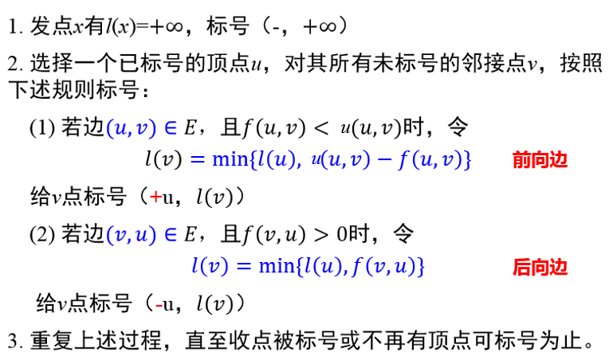

标号中的第一个参数u表示在该增广链上与之相邻的紧前节点，该参数的正负号仅表示方向；第二个参数$l(v)$表示允许的调整量，计算方法为min{紧前节点的标记值,当前节点调整量}。调整量的计算方法因前向边和后向边而有所不同。

我们得到最大流算法的具体步骤如下：

1.  初始流*f*（如零流）
2.  用标号法寻找*f*的增广链*Q*
3. 增广链上的流量调整过程
4. 重复上述两过程，直至不存在增广链为止。（即终点得不到标号）

**例题**：求图6.20示例网络中的最大流，边上的参数为（$u(e)$，$f(e)$），当前网络流*f*为17。

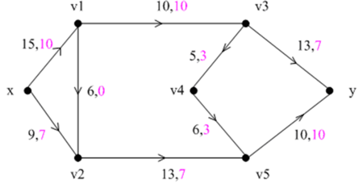

图6.20 最大流问题示例网络

**步骤1**：由于当前网络已经给出了初始流，下面直接用标号法寻找*f*的增广链。

从节点x出发，按照前向边和后向边的编号更新规则，依次对节点进行标号。各节点标号结果及所求的增广链如图6.21所示，括号左边的参数表示当前节点相邻的紧前节点，该参数的正负号仅表示方向；括号右边的参数表示当前节点连接紧前节点的边上允许的调整量。

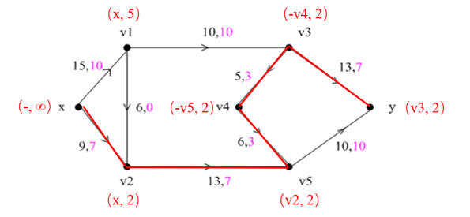

图6.21 第一次标号结果

**步骤2**：增广链上的流量调整

我们找到这样一条增广链x-v2-v5-v4-v3-y，整条链上允许调整的最小流量为2单位。后向边(v4, v3), (v4, v3)减少2个单位流量，其余边为前向边，增加2个单位的流量。调整后的网络流如图6.22所示，流值为19。

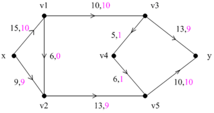

图6.22 增广链上的流量调整结果

**步骤3**：继续用标号法寻找*f*的增广链，结果如图6.23所示。

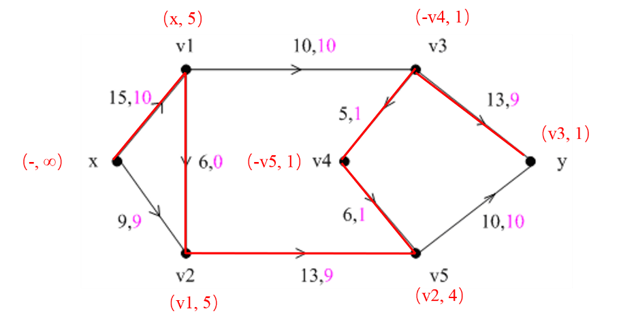

图6.23 第二次标号结果

**步骤4**：增广链上的流量调整

增广链x-v1-v2-v5-v4-v3-y 上允许调整的最小流量为1个单位，调整后的网络流及节点标号如图6.24所示。

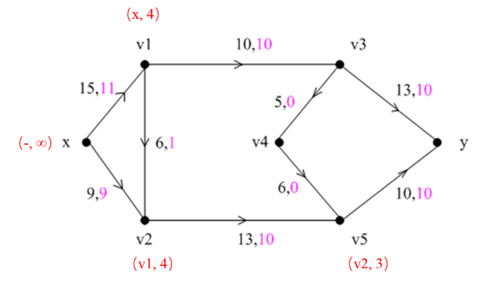

图6.24 第三次标号结果

由于收点y无法标号，既不存在增广链，所以当前流为最大流，流值为20。

#### 模型表达

除了应用上述的标号算法，我们还可以将最大流问题写成以下的线性规划模型，用单纯形法或者优化求解器进行求解。

$$
Maximize\quad f\\
s.t.\quad \sum_{j=1}^{m}{x_{ij}}-\sum_{k=1}^{m}{x_{ki}}=b_i=\begin{cases}f,\quad if\quad i=1\\0,\quad if\quad i\neq1\quad i\neq m\\-f, \quad if\quad i=m\end{cases}\\
0\leq x_{ij}\leq u_{ij}\quad i,j\in\{1,...,m\}
$$
变量*f*表示网络*N*上的流值，即为所求的最大流，变量$x_{ij}$表示边(*i*, *j*)上的流值大小，为$b_i$节点*i*的净流量。第一个约束条件是针对源，中间节点，汇的流量守恒约束；第二个约束条件是容量约束，$u_{ij}$为边(*i*, *j*)上的容量。

#### 最大流最小割定理

在本节的最后，我们补充介绍一个重要的定理——最大流最小割定理。

**割**，**是有向边的集合**。对运输网络，如果把发点*x*所在的集合设为S，收点*y*所在的集合设为$\bar{S}$，则由集合S指向集合$\bar{S}$的边称为一个割。主要注意，网络中的节点不是在集合S，就在集合$\bar{S}$中。割边的容量之和称为**割容量**。如果把割集从网络中移除，余下的图不一定能分成两部分，但一定能把从*x*到*y*的路径切断，此时就不存在*x*到*y*的流。

**最大流最小割定理：网络中从x到y的最大流等于分离x和y的最小割的容量。**

最大流最小割定理直观上并不难理解。割集可以看成网络中的瓶颈，那最小割容量的割集就是整个网络中“最窄”的瓶颈，是影响网络流增加的关键因素。故网络中存在最大流，必等于该网络的最小割容量。

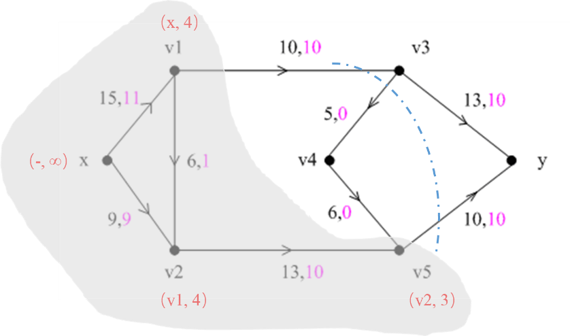

图6.25 割集

### 6.2.4 最小费用流问题

#### 问题描述

对运输企业而言，控制运输成本的方法主要有两个：（1）单次运输过程中运送尽可能多的货物（这也是为什么货车经常超载的原因）；（2）选择运输费用最小的路径，如不饶远路，不走高速等。这涉及到网络流中的一个经典问题：最小费用流问题。

首先，什么是最小费用流问题？我们仍以运输网络为例进行介绍。从字面上理解，最小费用流问题是要找到使得运输费用最小的运输方案。当然了，费用是与运量相关的。运输的货物多，费用自然高了；运输的货物少，费用自然就低。那么如何表示运量跟费用呢？

设*f*是网络上一个流（即一种运输方案），𝑉𝑎𝑙 𝑓=𝜆（即运量），编号为e的边上的权值W(*e*)表示在*e*边上运送一个单位的流量所花费的费用，*f*(*e*)表示在*e*边上运送的货物量。

那么整个运输方案的费用可以这么计算：
$$
W(f) = \sum_{e\in E}{W(e)f(e)}
$$
𝑊(𝑓)也就是流*f*的费用，E为网络中边的集合。

**最小费用流**：当运量为𝜆的情况下，使得𝑊(𝑓)最小的***f****称为N上一个流值为**λ**的最小费用流。

**最小费用最大流**：若*λ*为网络上最大流的流值，则称使得𝑊(𝑓) 最小的***f****为最小代价的最大流。

#### 问题求解

求解最小费用流问题，就是在**运量一定**的前提下要找到一个**运输费用最小**的**运输方案**。这个问题有两个目标，一是要保证运输的流值，二是要确保费用最小。目前的算法无法一步到位求得最小费用流，只能分步实现目标。

这么看来，在网络中求流值为𝜆最小费用流有以下两种思路：

（1）  给定流值𝜆，寻找最小费用流。在网络中任取一个流值为𝜆的流*f*，通过不断调整，降低费用，最终求得最小费流。

这一思路要解决的关键问题是如何调整*f*，使得费用下降，流值不变？

（2）  给定最小费用流，提高流值𝜆。在网络中任取一个流值小于𝜆的最小费用流*f*（例如，*f*为零流），通过不断调整，将流值提高到𝜆。

这一思路要解决的关键问题是如何调整*f*，使得流值提高，费用仍是最小？

在最大流问题这一节中介绍了如何在增广链上提高流值，那么如何在保证流值不变的情况下，降低费用呢？能否找到这样一条链，在这条链上调整流量，流值不会发生变化，但是费用可以降低。为此，这里引入**增流网络**$N_f$这一概念。

**增流网络**$N_f$与原网络$N$有相同的节点。$N_f$上两节点的边（*u*, *v*）既可以是前向边（可增加流值），也可以是后向边（可降低流值），也可以两者兼有，取决于$N$上$f(e)$与$u(e)$的关系。增流网络$N_f$边上的参数仅有边的容量及权值，记为(u’(*e*)，W’(*e*))。

①  如果$N$有$f(e)<u(e)$，即**非饱和边**，那么$N_f$对应的边上**既有前向边，也有后向边**。前向边的容量$u’(e)=u(e)-f(e)$，$W’(e)=W(e)$，表示可以该边上可以增加的流值；后向边的$u’(e)= f(e)$，$W’(e)=-W(e$)，表示该边上可降低的流值。

②  如果$N$有$f(e)=u(e)$，即**饱和边**，那么$N_f$对应的边上**仅有后向边**。饱和边是无法增加流值的，但是可以反向降低流值。同理有$u’(e)= f(e)$，$W’(e)=-W(e$)

③  如果$N$有$f(e)=0$，即**零流边**，那么$N_f$对应的边上**仅有前向边**。零流边可以增加流值，但无法降低流值。同理有$u’(e)=u(e)-f(e)= u(e)$，$W’(e)=W(e$)。

下面我们给出一个构造增流网络$N_f$的例子，见图6.26，边上的参数从左往右依次是（u(*e*)，*f*(*e*)，W(*e*)）。在原网络N中，（*x,* *v*1）和（*v*1, *v*2）是非饱和边，所以增流网络$N_f$中既有前向边（*x*, *v*1）和（*v*1, *v*2），也有后向边（*v*1, *x*）和（*v*2, *v*1）。（*x*, *v*2）和（*v*2, *y*）是饱和边，所以$N_f$中仅有后向边（*v*2, *x*）和（*y*, *v*2）。因（*v*1, *y*）是零流边，所以$N_f$中仅有前向边（*v*1, *y*）。

    

图6.26 构造增流网络示例

接下来我们介绍如何在增流网络$N_f$求得最小费用流。

针对上面提出的两种思路，我们分别给出两种求流值为𝜆最小费用流的算法。

------

**算法一：给定流值𝜆，寻找最小费用流**

算法步骤如下：

①  在N中任取一个流值为𝜆的流*f*

②  作增流网络$N_f$

③  判断$N_f$中是否存在负回路Q（回路权值为负）？ 

- 若存在Q，则按回路容量调整*f*，调整量*δ*是Q中容量的最小值，即

  *δ*=min{ C’(*e*) | *e*为Q中有向边}

  在N上得到调整后的流$\tilde{f}$

  

  
  $$
  \tilde{f} = \begin{cases}f(e)+\delta\quad e\in Q,前向边\\f(e)-\delta\quad e\in Q,后向边\\f(e)\quad e\notin Q\end{cases}
  $$

  因为在回路上调整流量，所以流值不发生改变。

  修改当前流的费用：
  $$
  W(\tilde{f}) = W(f)+\delta\sum_{e\in{Q}}W'(e)
  $$
  因为Q为负回路，所以有 $\sum_{e\in{Q}}W'(e)<0$  ,当前流的费用降低。返回步骤②。

- 若不存在Q， 则*f*即为所求的最小费用流，算法终止。

在这个过程中有两个关键点：

① 按$N_f$中的回路容量调整*f*；

② *f*为*N*上流值λ的最小代价流的充要条件：**在$N_f$中不存在负回路**。

------

**例题：**已知网络N上的流*f*, 流值𝑉𝑎𝑙 𝑓=4，求最小费用流，弧上的数字$u(e)、f(e)、W(e)$分别表示边容量、流值和权重。

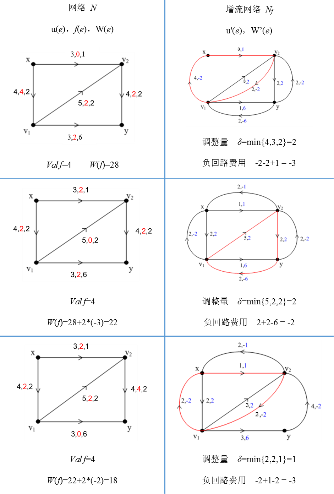

------

**算法二：给定最小费用流，提高流值到𝜆**.

算法步骤如下：

①.  取初始流*f*为零流。

② . 判断  *Val f*=𝜆 ？

- 若是， 则f即为N中流值为𝜆的最小费用流，算法终止。

- 若否，则作增流网络N*f*.

③. $N_f$中是否存在一条从*x*到*y*的路径？

- 若是，则找一条最短路径P。调整量$\delta$为：
  $$
  \delta = min\{u'(P),\lambda-Valf\}
  $$
  在N上得到调整后的流$ \tilde{f}$
  
  
  $$
  \tilde{f} = \begin{cases}f(e)+\delta\quad e\in P,前向边\\f(e)-\delta\quad e\in P,后向边\\f(e)\quad e\notin P\end{cases}
$$
  调整后的流值为$Val f +\delta$, 返回步骤②*.*
  
- 若否，则N中不存在流值为*λ*的最小费用流，*f*即为N中最小费用流，算法终止。

如果求最小费用最大流，𝜆取值为无穷。

算法二关键点：

① 按$N_f$中的最短路的容量调整*f*；

② *f*为*N*中最大流的充要条件：**在$N_f$中不存在一条从*x*到*y*的路径**。

------

**例题**：已知流值为4的最小费用流，求该网络的最小费用最大流。

已知当前流为最小费用流了，故增流网络$N_f$中不存在负回路。我们要在$N_f$中的最短路径上提升流值，才能保证更新后的*f*的费用依然最小。以下是具体的求解过程。

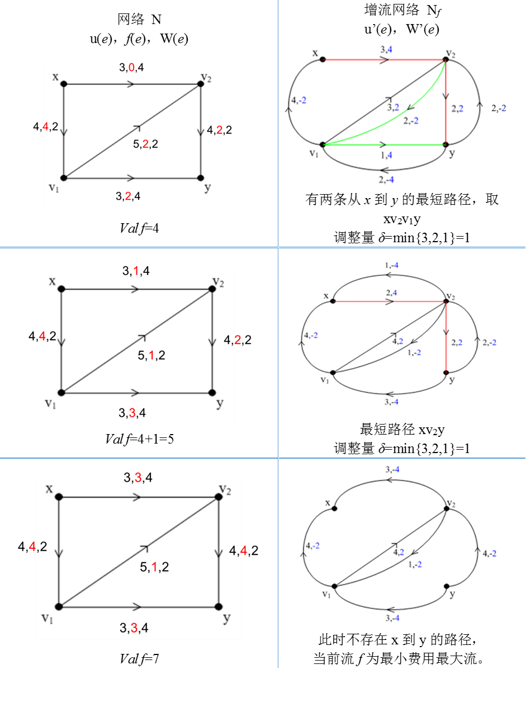

总的来说，求解最小费用最大流问题要先构造**增流网络**$N_f$，若$N_f$上存在负回路，则说明当前流的费用可以降低；若$N_f$上存在起点到终点的路径，则说明当前流值可提升。

#### 模型表达

同样地，最小费用流问题也可以写成线性规划模型。

考虑有向连通图，该图中至少含有一个供给节点，一个需求节点。决策变量：$x_{ij}$表示边(*i, j*)上的流量；其它变量：$c_{ij}$表示边(*i, j*)是上单位流量的运输成本；$u_{ij}$表示边(*i, j*)上的容量；$b_{i}$表示节点*i*的净流量。$b_{i}$的取值与节点在网络中的性质有关。如果节点*i*是供给节点，则$b_{i}$等于正的需求*q*；如果节点*i*是转运节点，则$b_{i}$等于0; 如果节点*i*是需求节点，则$b_{i}$等于负的需求-*q*。

目标函数为使总运输成本最小。最小费用最大流问题的线性规划模型如下:

$$
Maximize\quad \sum_{i=1}^m\sum_{j=1}^mc_{ij}x_{ij}\\
s.t.\quad \sum_{j=1}^{m}{x_{ij}}-\sum_{k=1}^{m}{x_{ki}}=b_i=\begin{cases}q,\quad if\quad i=1\\0,\quad if\quad i\neq1\quad i\neq m\\-q, \quad if\quad i=m\end{cases}\\
0\leq x_{ij}\leq u_{ij}\quad i,j\in\{1,...,m\}
$$
第一个约束条件中的第一求和项表示由节点i流出的流量和；第二求和项表示流入节点i的流量之和。对比前面提高的最短路线性规划模型，其实最短路问题可视为最小费用流问题的特殊情况，即边容量均为1的情形。

#### 其他应用

最小费用流问题除了在运输问题中有较多的应用外，还有许多别的应用场景，此处仅介绍建模思路，求解过程略。

- 缺货问题

  现有3个汽车配件厂x1、x2和x3，欲将配件运往3个汽车修配厂y1、y2、y3。若修配厂需要的配件得不到满足，就要形成缺货损失费。设y1处不能缺货， y2、y3处每缺一个单位配件就分别造成缺货损失费2和3。其它有关参数如下表。问如何调配，使总的费用最低？

  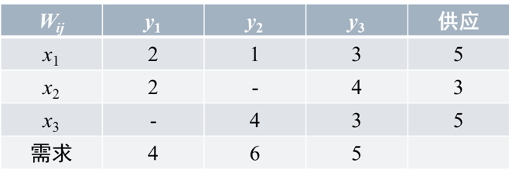

  缺货问题实际上是运输问题的一种，是供给（13: 5+3+5）<需求（15: 4+6+5）的运输问题。我们通过引入虚拟节点和虚拟边，可以将这类缺货问题转换为供需平衡的运输问题。

  据题意，我们构建了图6.27所示的网络图模型（单源单汇网络）。边上的参数为（Cij, Wij）。因为缺货2个单位，故设置一个虚拟的供应点x4，因y1不能缺货，y2,y3允许缺货，故设置有向边（x4, y2），（x4, y3）的边容量为2，Wij为缺货费2和3。若求解结果显示*f*（x4, y2）> 0，这意味着y2处存在缺货*f*（x4, y2）单位，y2实际收量为6- *f*（x4, y2）。若*f*（x4, y2）= 0，这意味着y2处不缺货。

  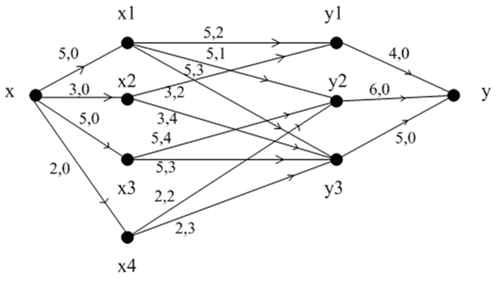

图6.27 缺货问题的网络图模型

- 生产计划问题

  某工厂明年根据合同，每个季度末向销售公司提供产品，有关信息如下表。若当季生成的产品过多，季末有积余，则一个季度每积压一顿产品需支付存储费0.2万元。现该厂考虑明年的最佳生产方案，使该厂在完成合同的情况下，全年的生产费用最低。

  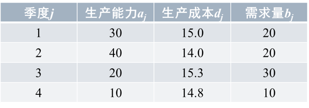

  设x为源（工厂），y为汇（销售公司），vj为第j季度产品的存储与供货点（j=1,2,3,4）。我们将每季度的生产能力aj设为边（x, vj）的容量$C_{x{v_j}}$ ,生产能力dj设为边（x, vj）的费用  , 需求量bj设为边（vj, y）的容量  ，无成本，故  =0。考虑部分产品可能积压一个季度，需付存储费0.2万元，故有  = 0.2. 得到的网络图模型如图6.28所示。

  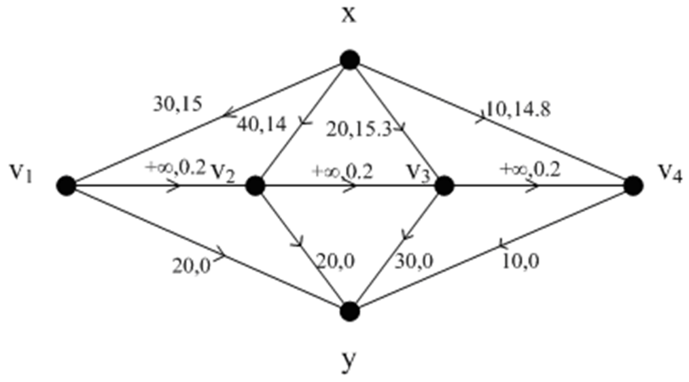

  
图6.28 生产计划问题的网络图模型

## 参考文献

[1]  Bertsimas, Dimitris, and John N. Tsitsiklis. Introduction to linear optimization. Vol. 6. Belmont, MA: Athena Scientific, 1997.

[2]  Bazaraa M S , Jarvis J J , Sherali H D . Linear programming and network flows[M]. WILEY, 1977.

[3]  Ahuja R K, Magnanti T L, Orlin J B. Network flows: theory, algorithms, and applications[J]. Journal of the Operational Research Society, 1993, 45(11):791-796.

[4]  Goldberg A V, Radzik T. A heuristic improvement of the Bellman-Ford algorithm[J]. Applied Mathematics Letters, 1993, 6(3):3-6.

[5]  Bundy A, Wallen L. A* Algorithm [M] Catalogue of Artificial Intelligence Tools. 1984.

[6]  Hillier F S. Introduction to operations research [M]. Tata McGraw-Hill Education, 2012.

[7]  马进.运筹学[M].北京:人民交通出版社，2003:186-192

[8]  傅家良.运筹学方法与模型 第2版[M].上海：复旦大学出版社.2014.